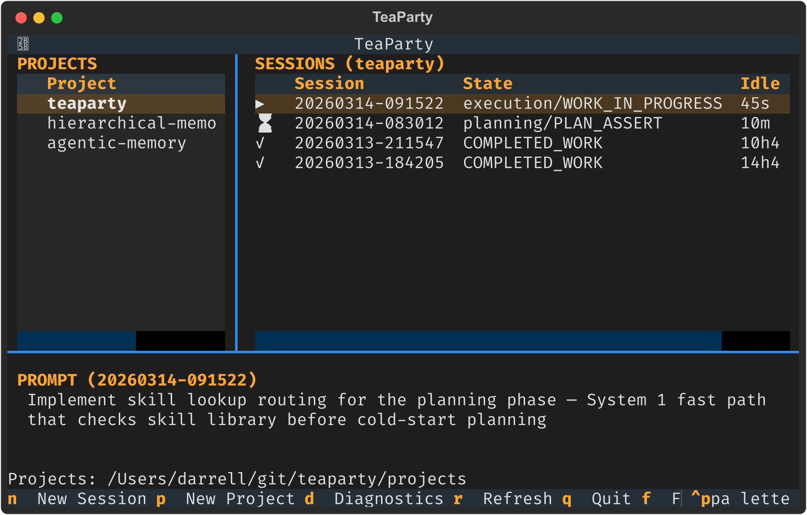
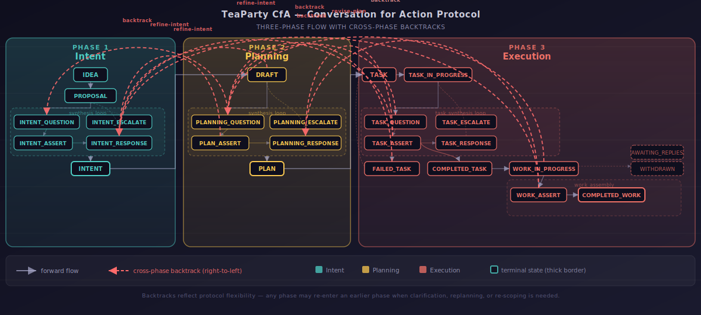

<p align="center">
  
</p>

<h1 align="center">TeaParty</h1>

<p align="center">
  <strong>A research platform for durable, scalable agent coordination</strong>
</p>

> **Status: Experimental.** TeaParty is an active research project exploring how humans and AI agents can work together on complex tasks. The ideas are promising, the architecture is evolving, and things break regularly. Nothing here is production-ready. If you're interested in the research direction, welcome — but expect rough edges, incomplete features, and frequent redesigns.

<p align="center">
  <a href="https://dlewissandy.github.io/teaparty/">Documentation</a> &middot;
  <a href="https://dlewissandy.github.io/teaparty/experimental-results/">Experimental Results</a> &middot;
  <a href="https://github.com/dlewissandy/teaparty/issues">Issues</a> &middot;
  <a href="CONTRIBUTING.md">Contributing</a>
</p>

---

Current agent systems fail at four things: they treat requests as complete specifications (**intent gap**), they offer only a binary dial between full autonomy and constant oversight (**escalation failure**), they cannot recover when execution reveals that the plan — or the intent itself — was wrong (**no backtracking**), and they lose coherence as context grows (**context rot**).

TeaParty is building toward mixed teams where humans and AI agents collaborate on increasingly complex projects — not agents as tools, and not agents as autonomous replacements, but genuine teams where each member contributes what they do best.

<p align="center">
  
</p>

<p align="center"><em>The POC dashboard: projects, sessions with CfA state tracking, and task prompts at a glance.</em></p>

## Four Research Pillars

### Conversation for Action

*Addresses: intent gap, backtracking*

A three-phase protocol — **Intent**, **Planning**, **Execution** — formalized as a state machine with explicit transitions and ten cross-phase backtracks. Each phase produces artifacts that make implicit context explicit. Approval gates between phases are learning opportunities where the system observes human corrections and preferences.

The key insight is backtracking. When execution reveals a flawed plan, the system returns to planning. When planning reveals a flawed intent, the system returns to intent. When final review reveals that the work faithfully implements an intent that turns out to be wrong, the system backtracks all the way from the end to the beginning. This is the most expensive transition — and without it, the only option is to ship work that misses the point.

<p align="center">
  
</p>

<p align="center"><em>The CfA state machine: three phases with synthesis loops and ten cross-phase backtrack transitions. <a href="https://dlewissandy.github.io/teaparty/cfa-state-machine/">Full specification &rarr;</a></em></p>

### Hierarchical Teams

*Addresses: context rot, scoping*

Complex work requires complex team structures. A single flat team trying to coordinate strategy and write every file hits context limits and loses coherence. TeaParty separates strategic coordination from tactical execution: an uber team manages strategy while subteams execute in parallel, each in its own process with its own context window. Liaison agents bridge levels, compressing context at each boundary. The uber lead never sees raw file content; subteam workers never see cross-team coordination.

```
    Project Lead
    /    |    \
Coding  Writing  Research     <- liaison agents (context boundary)
Liaison Liaison  Liaison
  |       |        |
[team]  [team]   [team]      <- isolated subteams (separate processes)
```

[Hierarchical Teams &rarr;](https://dlewissandy.github.io/teaparty/hierarchical-teams/)

### Human Proxy Agents

*Addresses: escalation failure*

As agent teams grow, the human becomes a bottleneck. The proxy agent learns to stand in for the human — answering clarifying questions, responding to escalations, approving plans — based on an evolving model of what the human would decide. Asymmetric regret weighting ensures false approvals cost more than false escalations. The proxy earns autonomy through demonstrated alignment, not configuration.

The proxy's governing principle: **understand first, act second.** Before agents produce artifacts, the proxy runs an intake dialog — formulating predictions about what the human wants and checking them. Where predictions are confident, it answers for the human. Where they're uncertain, it escalates. The delta between predictions and actual answers is the highest-value learning signal in the system.

[Human Proxy Agents &rarr;](https://dlewissandy.github.io/teaparty/human-proxies/)

### Hierarchical Memory and Learning

*Addresses: context rot, scoping*

Learning is a retrieval problem — getting the right knowledge to the right agent at the right moment. Three learning purposes (organizational norms, task procedures, proxy preferences) feed a promotion chain that moves validated learnings up through the hierarchy. Four learning moments (prospective, in-flight, corrective, retrospective) capture knowledge at the points where it matters most.

[Learning System &rarr;](https://dlewissandy.github.io/teaparty/learning-system/)

## Bootstrapping

TeaParty eats its own dogfood. The platform's documentation, design artifacts, and implementation are produced by hierarchical agent teams running the TeaParty POC — the same coordination patterns we're researching are the ones we use to build. Every page in this documentation, every architectural decision, and every line of code has been produced or reviewed by agent teams operating under the protocols described above.

## Quick Start

### Prerequisites

- Python 3.11+
- [uv](https://docs.astral.sh/uv/) package manager
- [Claude Code CLI](https://docs.anthropic.com/en/docs/claude-code) with a valid API key

### Install

```bash
git clone https://github.com/dlewissandy/teaparty.git
cd teaparty
uv sync
```

### Run the HTML dashboard

```bash
./teaparty.sh
```

Open http://localhost:8081 in your browser. The dashboard shows active sessions, dispatches, and CfA state transitions in real time.

### Run a session (CLI)

```bash
# Full CfA lifecycle: intent -> planning -> execution
uv run python -m projects.POC.orchestrator "Build a feature that does X"

# Phase control
uv run python -m projects.POC.orchestrator --intent-only "Explore this idea"
uv run python -m projects.POC.orchestrator --plan-only "Plan this feature"
uv run python -m projects.POC.orchestrator --execute-only "Just build it"

# Inject pre-written artifacts
uv run python -m projects.POC.orchestrator --intent-file INTENT.md "Build on this"
uv run python -m projects.POC.orchestrator --plan-file PLAN.md "Execute this plan"

# Fully autonomous (no human prompts)
uv run python -m projects.POC.orchestrator --no-human --execute-only "Automated task"

# Resume a crashed or interrupted session
uv run python -m projects.POC.orchestrator --resume SESSION_ID

# Diagnostics
uv run python -m projects.POC.orchestrator --dry-run -p myproject "Show memory + proxy state"
uv run python -m projects.POC.orchestrator -v "Verbose: trace proxy decisions and artifacts"
uv run python -m projects.POC.orchestrator --flat "Disable hierarchical dispatch"
```

### Run tests

```bash
uv run pytest projects/POC/orchestrator/tests/ --tb=short -q
```

### Build the docs

```bash
uv run mkdocs serve        # local preview at http://localhost:8000
uv run mkdocs build        # build to site/
```

## Documentation

Full design documentation is published at **[dlewissandy.github.io/teaparty](https://dlewissandy.github.io/teaparty/)**.

| Section | Contents |
|---------|----------|
| [Conceptual Design](https://dlewissandy.github.io/teaparty/) | Architecture, CfA protocol, intent engineering, strategic planning, learning system, hierarchical teams, human proxies |
| [Detailed Design](https://dlewissandy.github.io/teaparty/detailed-design/) | Agent runtime, CfA state machine implementation, approval gate, learning system internals |
| [Experimental Results](https://dlewissandy.github.io/teaparty/experimental-results/) | Ablative experiments across all four pillars: CfA backtracks, hierarchical vs. flat, proxy convergence, scoped retrieval, cost-quality frontier |

## License

All rights reserved.
