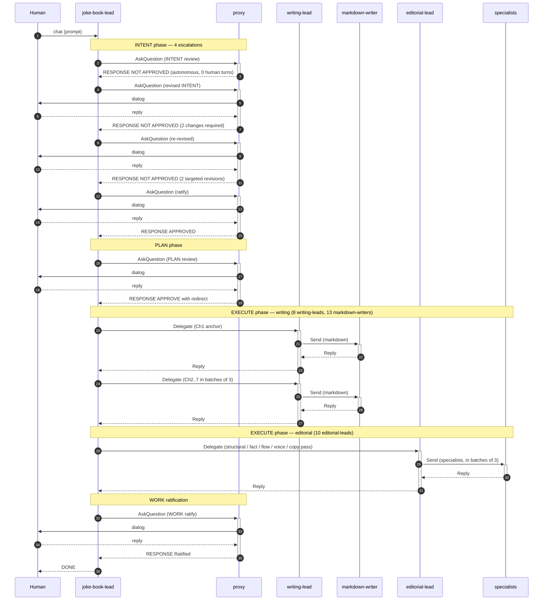
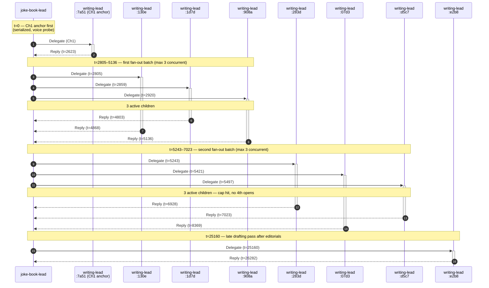
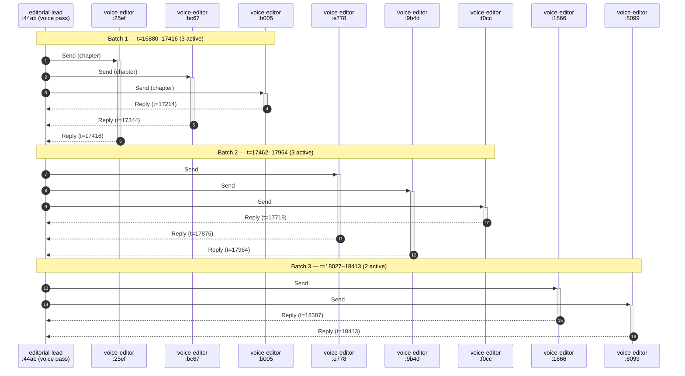

# Dispatch Tree

The May 2 session put 78 dispatches on the bus. Counted from the conversation table:

| Agent role | Count | Parent role |
|---|---|---|
| joke-book-lead | 1 | (top of tree, child of human chat) |
| writing-lead | 8 | joke-book-lead |
| editorial-lead | 10 | joke-book-lead |
| proxy | 6 | joke-book-lead (escalation threads) |
| markdown-writer | 13 | writing-lead (1–3 per parent) |
| voice-editor | 23 | editorial-lead (across 3 voice passes) |
| fact-checker | 8 | editorial-lead (one parallel fact-check pass) |
| copy-editor | 8 | editorial-lead (across copy passes) |
| style-reviewer | 2 | editorial-lead |

Three levels deep, every child gets its own `dispatch:<id>` thread, its own git worktree, its own claude session.

Below: three UML sequence diagrams. The first compresses the whole session into the major message-passing patterns. The next two zoom into specific windows where the **per-parent cap of 3 concurrent children** ([§13](../../cfa-engineering.md#13-configuration-surface)) is observable in the timing data.

---

## Diagram 1 — Macro session flow

The whole-session flow with one representative child per role. Reads top-to-bottom in time.

The shaded blocks group the CfA phases. AskQuestion calls flow to the proxy; some terminate autonomously (the first one), the rest go through human dialog before the proxy's RESPONSE returns to the caller. Delegate calls open dispatch threads to workgroup-leads; Send calls fan out from the workgroup-leads to specialists. Reply edges go back up the same channel — the thread is bidirectional.

---

## Diagram 2 — Writing-phase concurrency, joke-book-lead's view

**Eight writing-leads dispatched, never more than three concurrent.** Times below are seconds from session start (t=0 = 05:53:34 UTC).

Reading: the lead opened the Ch1 anchor first (sequential — Ch1 is the voice probe per the plan), then opened the next three Delegate threads in a 115-second burst (W2 → W3 → W4), waited for them all to settle, opened the next three (W5 → W6 → W7), waited again, then a single late W8. **At no point did the joke-book-lead have more than three writing-lead children active simultaneously.** The cap from §13 is observable in the activation pattern.

---

## Diagram 3 — Voice-pass fan-out, editorial-lead's view

**The same cap holds at the editorial-lead level.** This editorial-lead (`dispatch:44aba47d9149`, voice pass) dispatched 8 voice-editors. They ran in **three batches: 3, 3, 2.**

The pattern repeats across all three voice passes (3+3+2, 3+3+1, 3+3+2 = 23 voice-editors total). The fact-check pass at `dispatch:2404788a7008` showed the same shape — 8 fact-checkers in 3+3+2 batches.

The per-parent cap of 3 from §13 is enforced everywhere — at the project-lead level (writing-leads, editorial-leads) and at the workgroup-lead level (voice-editors, fact-checkers). A fan-out target of 8 reduces to three batches of (3, 3, 2); the concurrent count never exceeds 3. This is the close-before-spark-more discipline from [§13](../../cfa-engineering.md#13-configuration-surface).

---

## Closure is the lead's discretion

Two writing-leads (`283d258761f4`, `d5c742adab3d`) remained `active` on the bus when the session reached `DONE`. That's not a defect: closing a dispatch conversation is optional in CfA — the lead can close (which merges immediately) or leave the conversation open and rely on end-of-phase merge. Both writing-leads' work landed in the parent's worktree the same way through end-of-phase. 70 of 72 dispatches were explicitly closed; the other 2 were merged-without-close at phase boundary.
