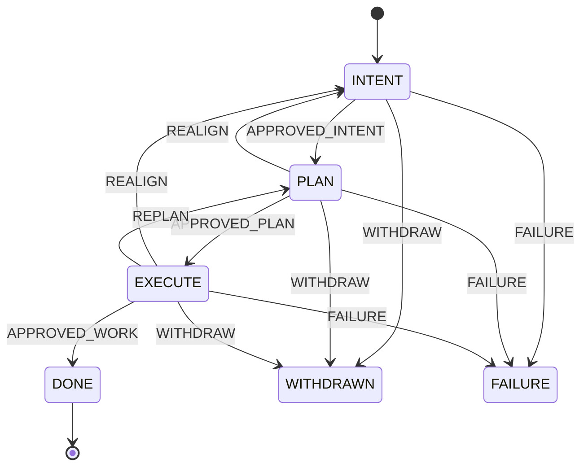
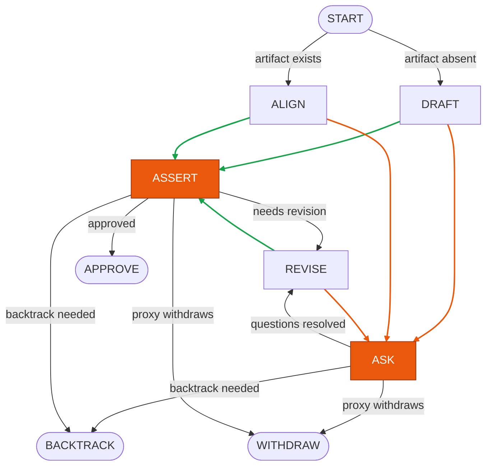

# CfA Orchestration — Engineering Design

## 1. Scope and audience

- Subject: the orchestration protocol and its operational contracts. What an implementer must build, not what we built.
- Out of scope: any specific implementation, language, library, file, or call signature.
- Reader: an engineer who will implement, port, or audit a CfA orchestrator from this document alone.

## 2. Conceptual model

A *job* is a single human request, traced from intake through a sequence of phases to a terminal that records what became of it. There is exactly one job per request, and the protocol governs its life from start to finish.

A job moves through a small, finite enumeration of *states*. Three are *live* and correspond to phases of work the job is currently in; the other three are *terminal* — completed, abandoned by the human, or failed beyond recovery. At any moment a job is in exactly one state. The three terminals are not interchangeable; subsequent behavior depends on which was reached.

A job moves between states by emitting an *action*. The actions form a finite enumeration: one approval per live state, one or more backtracks to earlier live states, an explicit withdraw, and a failure action raised when a state cannot recover. The mapping from action to target state is total and deterministic. Backtracks are ordinary actions — when execution discovers that planning was wrong, the job transitions to an earlier live state through a named action, and a backtrack counter on the job record is incremented.

The work in each live state is performed by a *skill* — a self-contained program that reads the job's persistent artifacts, does whatever work the state requires, and terminates by writing a structured *outcome record* with the action it has chosen. Skills are the only writers of terminal signals. The orchestrator does not infer from natural language or process exit codes that a state is over; if no outcome record has been written, the state has not ended. The contract makes the state machine auditable: every transition has a recorded origin.

A skill is run by an *agent* — an LLM-driven actor that the orchestrator launches into the state and supervises until the skill terminates. Agents are interchangeable executors; they do not embody the protocol's logic. The same agent can in principle run any skill the protocol supports, and the protocol does not bind specific skills to specific agents at the conceptual level.

Each agent runs in its own *workspace*: an isolated, sandboxed execution environment that holds the job's persistent artifacts, bounds the agent's tool calls, and materializes the state record. Nothing the agent does is permitted to escape the workspace without crossing a checked boundary. A workspace whose boundary cannot be verified at startup is not a legal place to run a skill, and the orchestrator refuses to launch.

Agents communicate through *conversations* — durable, addressable channels between two parties, typed by the relationship of the participants. A conversation's log is the canonical record of who said what to whom; no inter-agent context flows outside it. Routing between conversations is enforced at the channel level, not by agent prompts.

The human's participation in the protocol is mediated by a *proxy*: an agent that represents a specific human across every decision the protocol asks of them. A skill that needs human judgment opens a conversation with the proxy, not with the human directly. The proxy decides whether to answer on the human's behalf, escalate to the human, or acknowledge that the human has chosen to abandon the work. With a proxy in place, the protocol behaves the same whether the human is watching or not.

Skills *dispatch* work to other agents as *tasks*. A task is a unit of delegated work spawned within the lifetime of the job: it runs an agent in its own workspace and communicates with its dispatcher through a conversation. A task is not itself a job — the job is the top-level concept, and there is exactly one per human request — but a task is sandboxed and audited the same way a job is, and a task may itself dispatch further tasks. The result is a tree rooted at the job, with tasks as its interior and leaf nodes.

## 3. The protocol — state machine

The protocol is a finite state machine over six states, shown in Diagram 1. Three are *live* and three are *terminal*. A job enters at INTENT and runs until it reaches a terminal.

The action vocabulary divides by who emits each action. Skills emit forward approvals (one per live state), backtracks (REALIGN to INTENT, REPLAN to PLAN), and WITHDRAW when the human chooses to abandon the job. The orchestrator emits FAILURE when the current state cannot continue. A separate signal, PENDING, marks turns that ended without an outcome record; the state carries over to the next turn.

Action alone determines target state, and the mapping is total. The three live states are linearly ordered (INTENT < PLAN < EXECUTE), and a transition is a backtrack when its target precedes its source in that order. The graph has three backtrack edges, fired by REALIGN and REPLAN. The job record carries a counter tracking how many backtracks have fired.

**Diagram 1 — State machine.** The six states (three live, three terminal) and every transition between them, each labeled with the action that fires it. Initial entry is into INTENT; terminal exit is at DONE, WITHDRAWN, or FAILURE.



The three terminals carry distinct reporting semantics. *DONE* reports success — work approved by the human. *WITHDRAWN* reports human abandonment. *FAILURE* reports exhaustion — the orchestrator could not recover after a sequence of state-level failures. The three are not interchangeable.

## 4. The skill contract

Each live state is implemented by a Claude skill. The skill reads the persistent artifacts in the workspace, performs the work the state requires, and terminates by writing a structured outcome record at a fixed path. The record has two fields: an outcome name drawn from the protocol's action enumeration, and a human-readable reason.

A skill's permitted outcomes are exactly the actions originating from its state in the transition graph: in INTENT, approve or withdraw; in PLAN, also realign; in EXECUTE, also replan. A record with an outcome name outside this set is a contract violation, treated as a state-level failure.

The skill is the only writer of terminal signals. A turn that ends without the record having been written is a PENDING turn — the skill continues from the same state on the next turn. The orchestrator reads the record and applies the resulting transition.

**Diagram 3 — Generic phase skill anatomy.** The common shape every CfA phase skill follows. ASK and ASSERT (orange) are the human-engagement steps. DRAFT, ALIGN, and REVISE branch to ASSERT via green edges when the work is ready for confirmation, or to ASK via orange edges when open questions remain. Terminal steps APPROVE, BACKTRACK, and WITHDRAW write the outcome record — for forward approval, return to an earlier state, or abandonment.



The diagram is generic. Intent-alignment, planning, and execute each instantiate it with their own internals; the entry, working loop, and terminals are common to all three.

On a first run, no artifact exists; the skill enters at DRAFT and writes one from scratch. On re-entry — typically when a backtrack returns the protocol to this state — the prior artifact is present, and the skill enters at ALIGN to reconstruct it against an input that has shifted.

A dialog at ASK or ASSERT routes the skill to one of four outcomes: APPROVE if the human approves the work, REVISE if the human asks for refinements, BACKTRACK if the dialog reveals that an earlier state's work was wrong, or WITHDRAW if the human abandons the job. REVISE handles local edits when the artifact's shape is sound; a REVISE that becomes wholesale rewriting indicates input drift, which the skill should surface rather than silently restructure.

## 5. Agent dynamics

> *§5 describes the target model. The current implementation has a per-agent loop driver and gather-style fan-in for historical reasons; convergence to the rule system is scheduled for an upcoming milestone.*

Every agent in the system — top-level chat, dispatched task, CfA state lead — obeys the same set of reaction rules. There is no per-agent loop: agents are reactive, woken by their mailboxes, and rules fire in parallel wherever their LHS matches.

**Soup.** The system state is a multiset of molecules:

```
Soup ::=  ε
       |  Idle_A(t)                 -- A's t-instance is waiting for mail
       |  Run(A, t, m)              -- A is processing message m on thread t
       |  Send(B, t, msgs)          -- B's t-instance is broadcasting; msgs is a list of payloads (see below)
       |  Mailbox_A(t, queue)       -- A's inbox on thread t; queue of contents
       |  Parent(t', t)             -- thread t' was sparked from thread t (dispatch edge)
       |  Soup ‖ Soup
```

A *thread* is an opaque conversation identifier; the rule system treats it as a tag. Routing by thread structure (top-level chat, `dispatch:<id>`, `escalation:<id>`) lives in the layer above. Each (agent, thread) pair is an *independent instance*: its own mailbox, its own idle/run/send state, its own lifecycle. The same agent A can simultaneously be idle on one thread, running on another, and broadcasting on a third.

**Send payloads.** A `msgs` list contains entries of two kinds:

```
payload ::=  (A, t', x)       -- deliver content x to A's mailbox on t'  (consumed by [send] / [spark])
          |  terminate(t')    -- close thread t' and its subtree         (consumed by [send-terminate])
```

**Reduction rules.**

```
[send]            Send(B, t, (A,t',x):msgs)  ‖  Mailbox_A(t', as)   →   Send(B, t, msgs)  ‖  Mailbox_A(t', as ++ [x])
[spark]           Send(B, t, (A,t',x):msgs)                         →   Send(B, t, msgs)  ‖  Mailbox_A(t', [x])  ‖  Idle_A(t')  ‖  Parent(t', t)
                    when no Mailbox_A(t', _) in soup
[send-terminate]  Send(B, t, terminate(t'):msgs)  ‖  Parent(t', t)  →   Send(B, t, msgs)  ‖  Parent(t', t)  ‖  Terminate(t')
[send-empty]      Send(B, t, [])                                    →   Idle_B(t)
[wake]            Idle_A(t)  ‖  Mailbox_A(t, m:rs)                  →   Run(A, t, m)  ‖  Mailbox_A(t, rs)
[send-step]       Run(A, t, m)                                      →   Send(A, t, xs)
[nosend-step]     Run(A, t, m)                                      →   Idle_A(t)
```

[spark] is the "first Send to a new instance" rule: when B addresses (A, t') and no Mailbox_A(t', _) exists yet, the (A, t') instance is brought into being — with an inbox holding the spark message, an Idle state, and a `Parent(t', t)` molecule recording the dispatch edge from B's thread t to the new thread t'. [wake] becomes immediately fireable, so the new instance starts running on its first message. The `Parent` edge is what §9 walks to cascade withdrawal through the dispatch tree. Whether t' is a fresh thread to a known agent (continuation Send branching off into a new conversation) or a fresh thread to a fresh agent (dispatch creating a new child) is a runtime distinction below this layer; the rule sees only "no instance yet, now there is one." Provisioning the agent process, workspace, and MCP wiring is the runtime's responsibility — [spark] is the rule-level shadow of that event.

[send-step] and [nosend-step] share an LHS: a Run reduces non-deterministically to one or the other, and [send-step] itself admits any `xs`. This is the only non-determinism the rule system has — the agent's internal logic, opaque to the rules, picks the reduction. Operationally [send-step] with `xs = []` reaches the same soup as [nosend-step], but the trace differs: the former marks a Run that *intentionally* broadcast nothing; the latter, a Run that never entered the broadcast phase.

A single (A, t) instance enters the soup via [spark] and from then on traces one of two lifecycle paths per turn: `Idle_A(t) → Run(A, t, m) → Send(A, t, xs) → Send* → Idle_A(t)`, or `Idle_A(t) → Run(A, t, m) → Idle_A(t)`. The originating thread is preserved through the Send phase so the agent returns to Idle on the same thread it ran on. Different (A, t) instances run in parallel without synchronization.

**Diagram 2 — Concurrent reduction.** Rules fire wherever their molecules are disjoint. Given the soup:

```
Run(A, t₁, m₁) ‖ Idle_B(t₃) ‖ Send(C, t₄, [(D, t₂, hi)])
  ‖ Mailbox_B(t₃, [reply]) ‖ Mailbox_D(t₂, [])
```

three reductions can fire in parallel: [send] on `Send(C, t₄, ...) ‖ Mailbox_D(t₂, [])` (C's t₄-broadcast appending `hi` to D's t₂ inbox); [wake] on `Idle_B(t₃) ‖ Mailbox_B(t₃, [reply])` (B's t₃-instance starts processing); [send-step] on `Run(A, t₁, m₁)` (terminating Run with some `Send(A, t₁, xs)`). None of them consume the same molecules.

**Tier-specific behavior** enters in two places, both below the rule layer:

- **Inside Run** — the agent's logic decides `xs` and writes any disk side effects (outcome records, artifacts, telemetry).
- **As an orchestrator agent** — the orchestrator participates in the soup like any other agent: it observes disk and Sends into mailboxes (recovery messages after a failure, intervention text from the human, withdraw signals on cascading abandonment).

**Quiescence is termination.** A soup is at rest when no rule's LHS matches — every instance is Idle, every mailbox is empty, no Sends are in flight. Whether quiescence represents success, withdrawal, or failure is a disk-level fact, read by whoever cares.

## 6. The dispatch model

The rule system in §5 is silent on who can address whom and on what installs at [spark]. The dispatch model supplies both: a visibility relation populated by [spark] and [send], and a registration contract for new instances.

**Visibility.** When (B, t) sparks (A, t'), B's visibility gains (A, t'); A's visibility is initialized with (B, t). Subsequent participation on a thread teaches the participants about each other. No other rule grows visibility.

**Tree shape.** [spark] is the only edge-creating rule, and each spark adds exactly one (sparker → sparked) edge. The visibility graph is structurally a tree — siblings don't see each other, and no instance sees beyond its own subtree. Tree shape is not enforced; it falls out of how visibility propagates.

**Routing validity.** A Send is valid iff its (recipient, thread) is in the sender's visibility set. Invalid Sends do not reduce. §5's rules are silent on validity; the dispatch model is what supplies it. The check is structural and pre-delivery, not based on inspecting agent output.

**Spark installs the protocol surface.** When [spark] creates a new (A, t') instance, the runtime registers what the instance needs to participate: its allowed message types, its tool set, its workspace, its visible team. Every spark follows the same registration path; there are no per-tier shortcuts.

**Spawning vs. continuation.** A Send to a previously-unknown (A, t') sparks a fresh instance with no prior context. A Send to an existing (A, t') wakes that instance with the new message; continuity carries forward, and the dispatcher's conversation extends across as many turns as the work requires. The two paths are §5's [spark] and [send].

## 7. The escalation model

Escalation is the protocol by which a skill that needs human judgement obtains an answer. The primitive is **AskQuestion**: a single tool call that returns an answer (possibly a withdrawal). The model extends §5's rule system with new molecules and reductions.

**Molecules.**

```
AskQuestion(A, t, x, π)        -- A on thread t has asked question x under policy π
Proxy(t, x, π, h)              -- proxy is processing the question that A asked on t; h ∈ {fresh, post-human}
AskHuman(t, y, π)              -- proxy is waiting for the human's response to y
```

`π ∈ {never, when_unsure, always}` is the project's escalation policy for the caller's current state. `h` records whether the human has replied at least once during this escalation: `fresh` initially, `post-human` after the first [human-reply].

**Reduction rules.**

```
[ask-step]     Run(A, t, m)                              →   AskQuestion(A, t, x, π)
[ask]          AskQuestion(A, t, x, π)                   →   Proxy(t, x, π, fresh)  ‖  Idle_A(t)
[escalate]     Proxy(t, x, π, h)                         →   AskHuman(t, y, π)               when π ≠ never
[human-reply]  AskHuman(t, y, π)                         →   Proxy(t, x', π, post-human)
[respond]      Proxy(t, x, π, h)  ‖  Mailbox_A(t, as)    →   Mailbox_A(t, as ++ [ans])       when π ≠ always OR h = post-human
```

[ask-step] is another terminal for Run alongside §5's [send-step] and [nosend-step]: an agent's Run may produce an outgoing broadcast, fall directly to Idle, or pose a question. [respond] delivers the answer into A's mailbox; §5's [wake] then resumes A on its original thread. The proxy's choice of `y` (the framed question to the human), `x'` (the augmented context after a human turn), and `ans` (the final answer) is the only non-determinism the escalation rules add; everything else is structural.

**Policy semantics.**

- **`never`** — [escalate] is disabled. The proxy must answer from its own resources. `h` stays `fresh`; [respond] is free to fire.
- **`when_unsure`** — both [escalate] and [respond] are available at any cycle. The proxy chooses based on confidence. The cycle may iterate any number of times.
- **`always`** — [respond] is gated on `h = post-human`. The first reduction fired on a fresh Proxy must be [escalate]; only after [human-reply] flips `h` may [respond] fire.

Every escalation eventually reaches [respond]. The policy constrains *when*, not *whether*.

**Withdraw rides on the answer.** [respond] may deliver plain text (the proxy's answer) or `[WITHDRAW]\n<reason>` (a marker the calling skill recognizes as a signal to write its own withdraw outcome record). No separate rule; the marker convention is the only protocol element crossing the tool boundary.

**The proxy.** Inside Proxy, the runtime spawns a proxy instance with a clone of the caller's workspace as its cwd, plus the proxy's own memory of the human. The proxy reads the artifact under question, verifies claims against disk, and forms an opinion grounded in what was actually delivered. Under `never`, the answer comes from this material — the proxy's data and memory, not the question's framing.

**Concurrency and observability.** Multiple AskQuestion calls in flight simultaneously are admitted, including multiple from the same caller and multiple to the same human's proxy. Each is identified by the composite key `(caller_session, escalation_id)`. Escalations are sparked the same way as any dispatch (§6) — they appear in the audit trail like any other conversation; their thread is `escalation:⟨id⟩`.

## 8. The intervention model

Intervention is preemption: a participant — typically the orchestrator or the human — redirects an instance mid-Run by injecting a replacement message that takes the place of whatever the instance was about to consume.

**Molecule.**

```
Interrupt(t, Y)              -- redirect targeted at thread t, carrying replacement message Y
```

**Reduction rules.**

```
[interrupt]   Run(A, t, X)  ‖  Interrupt(t, Y)   →   Run(A, t, Y)
[wake-int]    Idle_A(t)     ‖  Interrupt(t, Y)   →   Run(A, t, Y)
```

[interrupt] preempts a running instance: the work in progress on X is abandoned, and the agent's Run resumes on Y. [wake-int] brings up a sleeping instance directly on Y, bypassing the mailbox-driven [wake]. Both rules consume the Interrupt molecule.

Scoping rides on thread choice. An interrupt scoped to the current state's instance targets the state's thread; the instance closes at state transition, so future Interrupts on that thread find no Run or Idle to consume them. An interrupt that should reach whichever instance is current targets a job-level thread that spans states. The thread choice is the scoping decision.

Intervention is not withdrawal. Interrupt redirects one instance with new content; the agent's own Run decides what to do with Y. Withdraw cascades through the dispatch tree and kills instances outright (§9). They share no rules.

## 9. The withdrawal model

Withdraw is the termination protocol. It cascades through the dispatch tree, killing every transitive child of the withdrawn thread, flushing in-flight mail, and dropping in-flight broadcasts.

**Molecule.**

```
Terminate(t)                 -- thread t and its subtree are being withdrawn
```

**Reduction rules.**

```
[term-run]    Terminate(t)  ‖  Run(A, t, X)        →   Terminate(t)
[term-idle]   Terminate(t)  ‖  Idle_A(t)           →   Terminate(t)
[term-mbox]   Terminate(t)  ‖  Mailbox_A(t, q)     →   Terminate(t)
[term-send]   Terminate(t)  ‖  Send(A, t, msgs)    →   Terminate(t)
[cascade]     Terminate(t)  ‖  Parent(t', t)       →   Terminate(t)  ‖  Terminate(t')
[term-final]  Terminate(t)                          →   ε    when no other t-tagged molecule remains
```

[term-run] through [term-send] consume every (A, t)-tagged molecule — instance, mailbox, in-flight broadcast — destroying the t-instance. [cascade] walks the `Parent(t', t)` edges introduced at [spark] time, propagating Terminate to each child thread; the edge is consumed so no thread is terminated twice. [term-final] self-erases the Terminate once nothing tagged with t remains.

Cascade is structural. The soup's `Parent` molecules carry the dispatch tree, and [cascade] walks them.

The marker convention from §7 is unchanged. A skill that wants to withdraw its own job (rather than being terminated by cascade) sets its answer string to `[WITHDRAW]\n<reason>` and lets the calling skill recognise it. The calling skill writes its own withdraw outcome record; eventually the orchestrator-as-agent emits a Terminate on the job thread, and the [term-*] rules clean up.

Resource release (workspaces, processes, telemetry close) happens below the rule layer as a consequence of the [term-*] rules consuming their molecules. From the rule layer's perspective, clean termination and cascaded termination are indistinguishable; the disk artifacts record the difference.

## 10. The workspace model

Every (A, t) instance has a workspace — an isolated filesystem region that holds the instance's artifacts and bounds the side effects its Run can produce. Instances are mutually inaccessible at the filesystem level by default: an instance does not see its siblings' workspaces and cannot reach above its own root. Artifacts persist at the workspace root by location, not by registry lookup — a file the agent writes is the file the next [wake] reads, with no naming layer in between.

The sandbox is structural, not prompt-driven. Each workspace contains a `.claude/` configuration constructed from agent A's role definition — only the tools and scripts A is permitted to invoke are visible to its Run. The configuration depends on A, not t: every (A, _) instance sees the same tool surface. A pre-tool-use boundary check refuses any tool effect that would escape the workspace's filesystem region; a workspace whose boundary cannot be verified at instance creation is a hard error at [spark] time, not a silent fall-through. Cross-instance artifact sharing is explicit — when a parent has content a child needs, [spark]'s registration copies the relevant files into the child's workspace by name. Workspace release happens below the rule layer, as the side effect of §9's [term-*] rules consuming an instance's molecules.

Workspaces are implemented as git worktrees. Two paths produce a merge into the parent's tree: an explicit close via [send-terminate], and end-of-phase merge for any dispatch the parent chose to leave open — closure is optional in CfA, and the two are operationally indistinguishable from the merge's perspective. A Terminate produced by [cascade] (an inherited withdraw) drops the workspace without merging. The parent is responsible for resolving any conflicts during merge.

## 11. Persistence and audit trail

The system commits durable records at three scopes. Per CfA job, a state record captures the orchestrator's state machine — the current state, the transition history, the backtrack count — updated on every transition. Per (A, t) instance, three things persist: an append-only stream logging the instance's turns, a Claude session handle that lets the next Run resume the conversation prefix from cache rather than cold-start, and a worktree (the instance's filesystem region from §10) carrying its on-disk state. Bus-level, the conversation log persists every message that crossed any thread — the materialized record of §5's Send and Mailbox molecules — and the dispatch graph persists §5's `Parent(t', t)` edges. Outcome records (§4) are written by skills at their terminals and ride alongside.

Three properties hold across these records. *Reconstructability:* state record, conversation log, and outcome records together suffice to replay any job's audit trail. *Monotonicity:* within a job, every record is append-only — the state transitions, but its history does not rewind. *Single source of truth:* the conversation log captures what actually crossed the bus; there is no parallel "what really happened" record alongside it.

**Resumption.** The bus is the persisted soup. Mailboxes, threads, and `Parent` edges survive a process crash; Idle / Run / Send molecules are transient. After a crash, the system reconstructs the soup by reading the bus — any instance whose mailbox is non-empty becomes `Idle_A(t) ‖ Mailbox_A(t, queue)`, and the next [wake] resumes the lifecycle. Per-instance state crosses the restart on two channels: the Claude session handle, so the next Run resumes its conversation prefix; and the worktree, so its on-disk state is exactly where the prior turn left it. The resumable point is turn-boundary quiescence — a crash mid-Run loses that turn's work (no Send was emitted, no mailbox grew), so crash-loss is bounded to one in-flight turn per dead process.

**Recovery.** Orphan recovery walks `Parent` edges on restart to re-attach live children whose parent's process died. A Run that exits with an error is observed below the rule layer and surfaces as a Send into the failing instance's mailbox: retry, substitute, or Terminate. No failure-specific primitives beyond §5's.

## 12. Invariants

The system promises the following testable properties, each defined in the named section.

### Protocol state machine (§3, §4)

1. **Deterministic transitions.** ACTION_TO_STATE is single-valued; each action names exactly one target state. Skill-emitted outcomes are constrained to actions valid for the source state; out-of-domain emissions are caught and converted to FAILURE.
2. **Termination guaranteed.** Every job reaches one of DONE, WITHDRAWN, FAILURE. Repeated state-level failure produces FAILURE rather than deadlock.

### Soup linearity (§5, §6)

3. **Single-instance lifecycle.** At any moment, each (A, t) pair has at most one of {Idle, Run, in-flight Send-as-state}, and at most one Mailbox.
4. **Tree shape.** Parent edges form a tree by construction — only [spark] creates them, and each spark adds one edge from a single parent.
5. **Spark exclusivity.** Every (A, t) instance's protocol surface installs exactly once.
6. **Routing locality.** A Send reduces only when (recipient, thread) is in the sender's visibility set.

### Workspace (§10)

7. **Sandbox integrity.** Sandbox boundary verified at [spark]; per-instance isolated; no instance reads above its root.

### Escalation (§7)

8. **Escalation reaches respond.** Every AskQuestion eventually fires [respond]; under policy `always`, [respond] follows at least one [human-reply].

### Withdrawal (§9)

9. **Cascade completeness.** Terminate(t) reaches every transitive child via Parent edges; Terminate(t) self-erases when no t-tagged molecule remains.

### Persistence and recovery (§11)

10. **Bus durability.** Mailboxes, threads, Parent edges, and outcome records survive process crashes.
11. **Bounded crash-loss.** A crash mid-Run loses at most that one turn's work; the system is recoverable to the last [send-empty] / [nosend-step].
12. **Audit append-only.** Every record within a job is append-only; reconstructability holds against the persisted records.

## 13. Configuration surface

The configuration surface is small. The protocol's semantics — reduction rules, state machine, cascade behavior, audit invariants — are fixed by design; configuration exists only where deployments differ. The knobs fall into two groups: *operational policy*, which a project owner tunes per deployment, and *protocol versioning*, which changes the protocol itself and requires a coordinated upgrade across all participants.

**Operational policy.** These knobs let a project shape behavior to its risk tolerance and resource budget without touching the protocol. The **per-state escalation policy** (`never`, `when_unsure`, `always`) decides how often the human is consulted — exposed at every CfA state because the right answer differs by phase: a routine planning step might admit `never`, while approving an irreversible execution step might require `always`. **Retry budget and timeout** bound the orchestrator-as-agent's recovery effort, trading wall-clock time against converting a stuck instance to FAILURE prematurely. The **per-parent fan-out cap** (currently 3) bounds working-set size: a spark that would exceed the cap is blocked until the parent closes an existing conversation, forcing close-before-spark-more discipline that prevents agents from running ahead of their ability to track child results. **Sandbox boundary policy** (tool-by-tool exemptions) and the **per-agent role definition** (the `.claude/` folder from §10) together control authorization — what each agent is permitted to do. **Per-skill configuration** is opaque to the orchestrator; skills carry their own internal state and the orchestrator does not interpret it.

**Protocol versioning.** Two values are versioned rather than tuned: the **conversation identifier scheme** (top-level chat, `dispatch:<id>`, `escalation:<id>`, etc.) and the **state-and-action enumeration** of the CfA state machine. Changing either requires every participant's routing layer or state machine to agree, so changes here are coordinated upgrades, not runtime decisions.
