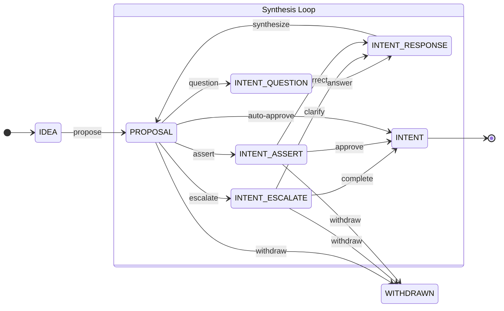
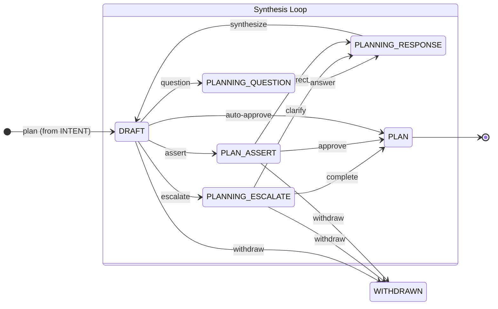
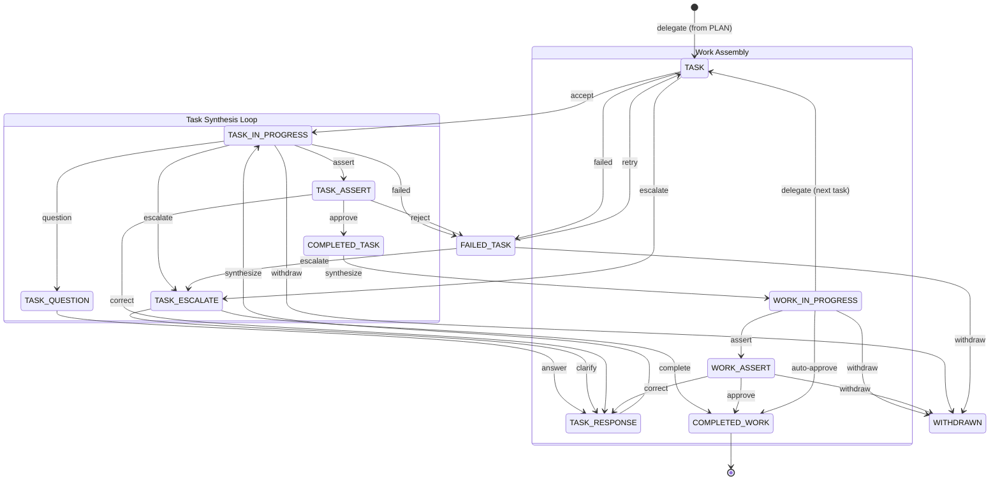
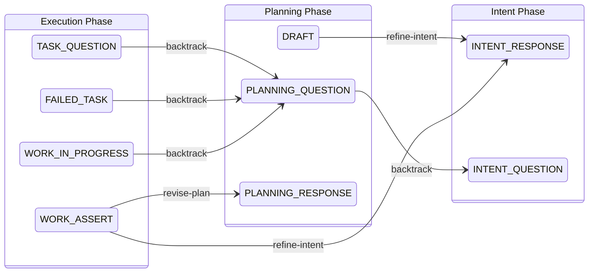

# CfA State Machine

The Conversation for Action (CfA) protocol is formalized as a three-phase state machine: **Intent**, **Planning**, and **Execution**. Each phase has its own states, a synthesis loop that refines artifacts through iteration, and escalation paths for human involvement. Phases connect through explicit backtrack transitions that allow the system to revisit earlier decisions when new information warrants it. Making this a formal state machine — rather than a prompt convention — means approval gates and backtrack transitions are auditable: each transition is logged, counted, and visible in the system, not just implied by agent behavior.

The state machine is defined in `cfa-state-machine.json` and implemented in `cfa_state.py`.

---

## Intent Phase

The intent phase transforms a raw idea into an approved intent — a specification of purpose that governs all downstream work. The human proposes, the intent team responds, and a synthesis loop refines the proposal until it converges into a stable intent.

**How it works:** The human starts with an IDEA, which becomes a PROPOSAL. The intent team can question, escalate to the human, or assert the proposal for approval. Each path feeds through INTENT_RESPONSE back to PROPOSAL (the synthesis loop), refining until the proposal is approved as INTENT. The human can withdraw at any point.

**Actors:**

| State | Actor |
|-------|-------|
| IDEA | human |
| PROPOSAL | intent team |
| INTENT_QUESTION | research team |
| INTENT_ESCALATE | human |
| INTENT_ASSERT | human |
| INTENT_RESPONSE | intent team |

---

## Planning Phase

The planning phase transforms an approved intent into an actionable plan. The planning team drafts, the synthesis loop refines, and the human approves. A backtrack to the intent phase is available if the planning process reveals that the intent itself needs revision.

**Backtracks to Intent:**

- DRAFT → *refine-intent* → INTENT_RESPONSE (the planning team realizes the intent needs revision)
- PLANNING_QUESTION → *backtrack* → INTENT_QUESTION (a planning question reveals an unresolved intent question)

**Actors:**

| State | Actor |
|-------|-------|
| DRAFT | planning team |
| PLANNING_QUESTION | research team |
| PLANNING_ESCALATE | human |
| PLAN_ASSERT | human |
| PLANNING_RESPONSE | planning team |

---

## Execution Phase

The execution phase transforms an approved plan into completed work. The execution lead delegates tasks to workers. Each task goes through its own synthesis loop. Completed tasks are assembled into the final work product, which goes through a final assertion before completion.

**Multi-task loop:** After each COMPLETED_TASK, the execution lead synthesizes progress into WORK_IN_PROGRESS, then either delegates the next TASK or asserts the final work product. This loop continues until all tasks are complete.

**Actors:**

| State | Actor |
|-------|-------|
| TASK | execution worker |
| TASK_IN_PROGRESS | execution worker |
| TASK_QUESTION | research team |
| TASK_ESCALATE | approval gate |
| TASK_ASSERT | execution lead |
| TASK_RESPONSE | execution worker |
| FAILED_TASK | execution worker / lead / approval gate |
| COMPLETED_TASK | execution lead |
| WORK_IN_PROGRESS | execution lead |
| WORK_ASSERT | approval gate |

---

## Cross-Phase Backtracks

Backtracks allow the system to revisit earlier phases when new information warrants it. Each backtrack increments a counter on the CfA state, providing visibility into how much rework is occurring.

**Seven backtrack transitions:**

| From | To | Trigger | Meaning |
|------|----|---------|---------|
| DRAFT | INTENT_RESPONSE | refine-intent | Planning reveals the intent needs revision |
| PLANNING_QUESTION | INTENT_QUESTION | backtrack | A planning question uncovers an unresolved intent question |
| TASK_QUESTION | PLANNING_QUESTION | backtrack | An execution question reveals a planning gap |
| FAILED_TASK | PLANNING_QUESTION | backtrack | Task failure indicates a planning problem, not an execution problem |
| WORK_IN_PROGRESS | PLANNING_QUESTION | backtrack | Assembly of completed work reveals the plan was insufficient |
| WORK_ASSERT | PLANNING_RESPONSE | revise-plan | Final review determines the plan needs revision |
| WORK_ASSERT | INTENT_RESPONSE | refine-intent | Final review determines the intent itself was wrong |

---

## Hierarchical CfA

The state machine supports recursive delegation through parent-child relationships. When a task is delegated to a subteam, a child CfA instance is created:

- **parent_id** links the child to the parent task
- **team_id** identifies which subteam is handling it
- **depth** tracks nesting level (0 = root/uber, 1+ = subteam)

Child CfA instances enter at the **planning phase** — the delegated task already carries approved intent from the parent scope. The child team plans and executes within its own context, and results flow back to the parent through the liaison agent.

---

## Terminal States

**COMPLETED_WORK** — the globally terminal success state. All work has been assembled, asserted, and approved.

**WITHDRAWN** — the globally terminal abandonment state. Accessible from most states in all three phases. Represents a deliberate decision to abandon the work, not a failure.
