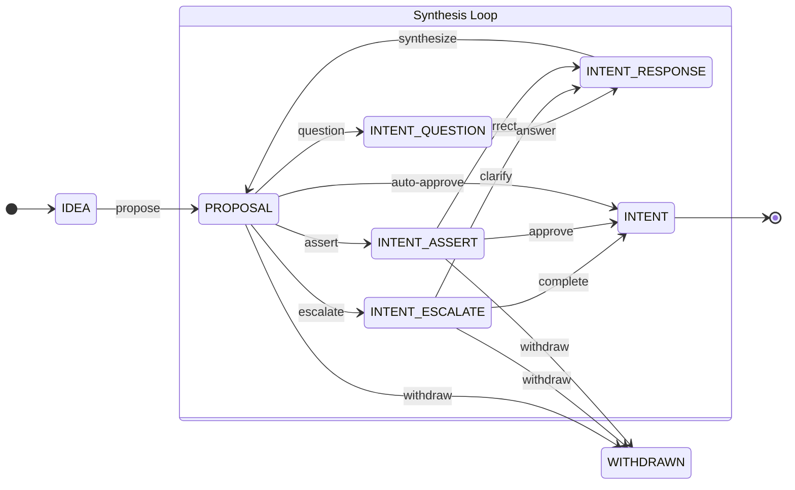
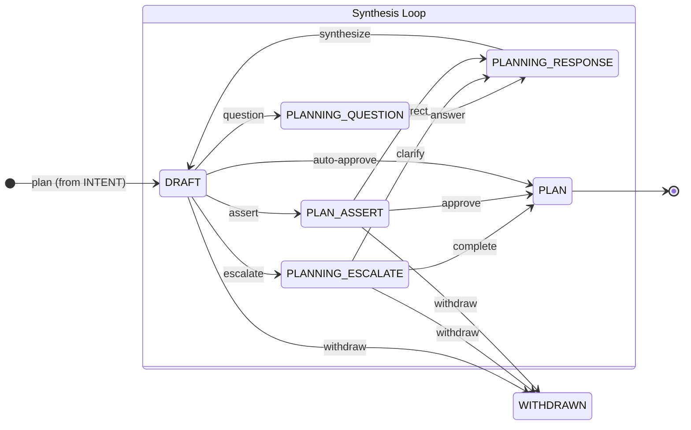
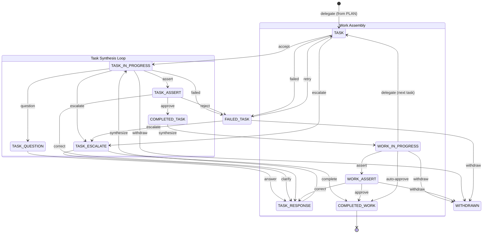
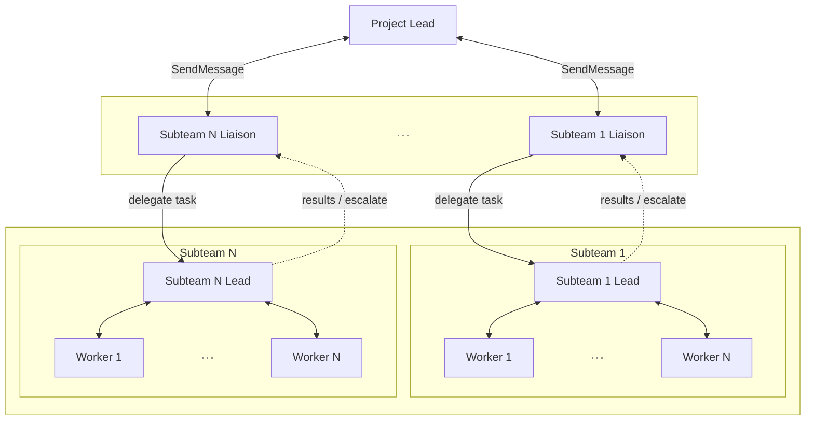
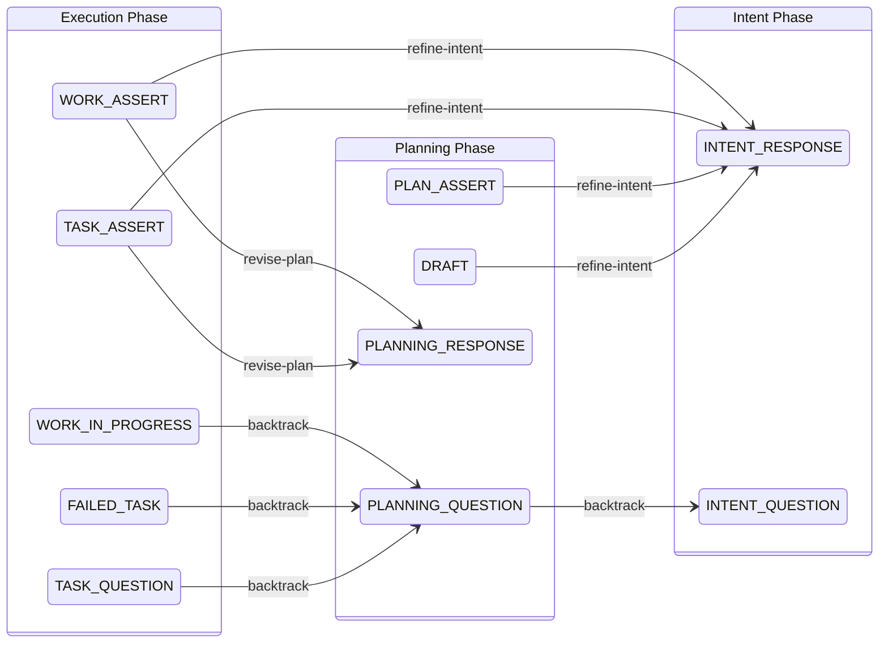

# Agentic Conversation for Action

The Conversation for Action (CfA) protocol is formalized as a three-phase state machine: **Intent**, **Planning**, and **Execution**. Each phase has its own states, a synthesis loop that refines artifacts through iteration, and escalation paths for human involvement. Phases connect through explicit backtrack transitions that allow the system to revisit earlier decisions when new information warrants it. Making this a formal state machine — rather than a prompt convention — means approval gates and backtrack transitions are auditable: each transition is logged, counted, and visible in the system, not just implied by agent behavior.

The state machine is defined in `cfa-state-machine.json` and implemented in `cfa_state.py`.

---

## Actors

Winograd and Flores's original Conversation for Action had two actors: A makes a request, B fulfills it. This works when both parties share enough context to negotiate directly. Agentic work is different. A raw idea must be refined into a specification. The specification must be decomposed into a plan. The plan must be executed by multidisciplinary teams. And at every boundary, someone must decide whether the work still aligns with the human's actual intent. Two actors cannot cover this.

TeaParty's CfA protocol has five actor types:

**Human.** The ultimate authority. The human proposes ideas, answers escalations, and makes final approval decisions. The system concentrates human involvement at the moments where it matters most — intent negotiation, plan review, and cases where the proxy's confidence is low — rather than spreading it across every decision.

**Human proxy.** A learned model of the human's preferences, risk tolerance, and decision patterns. The proxy participates in the conversation at every phase — not just at gates. Before agents produce artifacts, the proxy runs an intake dialog that builds shared understanding: it asks questions where its model of the human is uncertain, predicts answers where its model is confident, and calibrates from the delta between predictions and actual answers. At approval gates between phases, the proxy decides whether to approve or escalate — but a proxy that has built understanding through dialog makes better gate decisions than one that only sees the finished artifact. Between gates, the proxy answers clarifying questions from agent teams and engages in dialog about the human's preferences. Every interaction — intake answers, gate decisions, mid-work clarifications — is a learning opportunity that refines the proxy's model of the human.

**Intent team.** An intent lead and a research liaison. The intent lead refines the human's idea into a specification (`INTENT.md`) through a synthesis loop. The research liaison dispatches to a research subteam when the intent lead needs background investigation. Communication follows a spoke-and-wheel pattern: the lead is the hub, members communicate through the lead via SendMessage, eliminating bottlenecks from sequential handoffs.

**Planning and execution team (uber team).** A project lead and liaisons for each discipline — art, writing, editorial, research, coding. The project lead coordinates strategy; liaisons dispatch to specialized subteams via `dispatch.sh`, each subteam running in its own process and git worktree. The project lead never sees raw subteam conversations; liaisons compress results at each boundary. Same spoke-and-wheel communication: the project lead is the hub.

**Subteams.** Each subteam is a multidisciplinary team with its own lead and specialists. The coding team has an architect, coder, reviewer, and tester. The research team has web, arxiv, video, and image researchers. Writing, art, and editorial teams follow the same pattern. Each subteam runs its own CfA cycle — planning and executing within its scoped context — and returns results to the parent team through its liaison. Subteams never communicate with each other; all coordination flows through the uber team.

---

## Intent Phase

The intent phase transforms a raw idea into an approved intent — a specification of purpose that governs all downstream work. The human proposes, the intent team responds, and a synthesis loop refines the proposal until it converges into a stable intent.

The human starts with a raw idea. The intent lead takes that idea and develops it into a proposal — researching the problem space, identifying constraints, and surfacing tradeoffs the human may not have articulated. If the intent lead needs background information, it dispatches the research liaison to investigate.

On the happy path, the intent lead produces a proposal and asserts it for the human's approval. The human reviews and approves, producing the governing intent document.

More often, the proposal goes through several rounds of the synthesis loop. The intent lead may have questions that require research, surfacing information that changes the proposal. It may escalate to the human when it encounters ambiguity it cannot resolve on its own — but it brings options and recommendations, not open-ended questions. The human may correct the proposal when the intent lead has misunderstood something. Each correction or answer feeds back through the synthesis loop, producing a revised proposal. This continues until the proposal converges.

The human can withdraw at any point if the idea is no longer worth pursuing.

---

## Planning Phase

The planning phase transforms an approved intent into a plan. What "plan" means depends on the level.

The uber team produces a **strategic plan** — a reusable workflow that decomposes the work into large phases and sequences them. Strategic plans capture the shape of the work, not its details. They are largely independent of the specifics of any particular task. For example, a strategic plan for writing a research paper might be: survey the literature, construct the argument, draft sections in parallel, edit for coherence, typeset. That same workflow applies whether the paper is about hierarchical memory or human proxy agents.

Subteams develop **tactical plans** during execution, when they receive a specific assignment and must deal with its particulars. The research team assigned to "survey the literature on hierarchical memory" plans which databases to search, what keywords to use, and how to evaluate sources. Those details belong at the tactical level because they depend on the specific task.

The same state machine governs both levels; the difference is in what the plan contains, not how it is negotiated.

The project lead takes the approved intent and drafts a plan. It may dispatch research liaisons to investigate open questions — technical feasibility, prior art, resource availability. The research team returns findings, the project lead incorporates them, and the draft evolves.

On the happy path, the project lead asserts the plan for approval. The human proxy evaluates it against the human's known preferences and either auto-approves or escalates to the human. The human reviews and approves, and execution begins.

In the synthesis loop, the project lead may escalate to the human when the plan involves tradeoffs that require human judgment — scope vs. timeline, quality vs. speed. The human may correct the plan when it misaligns with their intent. Each round of feedback produces a revised draft. If the planning process reveals that the intent itself was wrong or incomplete, the system backtracks to the intent phase rather than planning around a flawed specification.

The human can withdraw if the work is no longer viable.

---

## Execution Phase

The execution phase is visibly more complex than intent or planning, and this is not accidental. The intent and planning phases each produce a single artifact through a single synthesis loop — one intent document, one plan. Execution produces many artifacts across many subteams, and those artifacts must be assembled into a coherent whole. This requires two nested loops: an inner loop where individual tasks are worked, reviewed, and refined, and an outer loop where completed tasks are assembled and the lead decides what to delegate next. Execution also introduces failure as a first-class state — a task can fail without killing the entire effort, and the system must decide whether to retry, escalate, or backtrack to replanning. Intent and planning do not need failure states because their artifacts are produced through dialog; execution needs them because it produces deliverables that can be objectively wrong.

The execution lead delegates tasks from the approved plan to subteams through liaison agents. Each liaison dispatches to a specialized subteam — coding, writing, research, art, editorial — which runs in its own process with its own context window. The subteam develops a tactical plan for its assigned task, executes it, and returns results through the liaison.

On the happy path, a worker accepts a task, produces the deliverable, and asserts it for the execution lead's review. The lead approves, synthesizes the completed task into the overall work in progress, and delegates the next task. When all tasks are complete, the lead asserts the assembled work for final approval by the human proxy.

Within each task, the synthesis loop handles the common case where work needs refinement. A worker may need research — dispatching questions to the research team. It may encounter a blocker and escalate to the approval gate, which either resolves it from the proxy model or escalates to the human. The execution lead may correct a worker's output, sending it back through the loop for revision. If a task fails outright, the worker can retry, or the lead can escalate or backtrack to replanning.

At any decision point, the human or its proxy can ask clarifying questions before approving, correcting, or withdrawing. The human can withdraw at multiple points — during task escalation, during work assembly, or during final assertion — if the work has gone off track beyond recovery.

Each subteam delegation creates a child CfA instance linked to its parent by a parent ID, team ID, and depth. Child instances enter at the planning phase — the delegated task already carries approved intent from the parent scope. The critical path here is escalation: when a subteam encounters a problem it cannot resolve, it escalates through the liaison back to the uber team. The uber team's execution lead can then correct the assignment, provide additional context, or backtrack to replanning if the issue is structural. This escalation path is what prevents subteams from going off track in isolation — they have a way to surface problems without needing to see the full strategic context.

Solid lines show task delegation flowing downward; dotted lines show results and escalations flowing back up. Each boundary is a process boundary — the uber team and each subteam run in separate processes with separate context windows. Liaisons are the only agents that cross this boundary.

---

## Cross-Phase Backtracks

Backtracks allow the system to revisit earlier phases when new information warrants it. Each backtrack increments a counter on the CfA state, providing visibility into how much rework is occurring.

There are ten backtrack transitions, grouped by how far back they reach.

**Planning → Intent (3 transitions).** Sometimes planning reveals that the intent itself is flawed. The project lead begins drafting a plan and realizes the objective is ambiguous or internally contradictory — the intent needs revision, not a better plan. A research question raised during planning may uncover an unresolved intent question — the planning team thought it was investigating a planning detail, but the answer changes what the project is trying to achieve. Or the human reviews the plan at PLAN_ASSERT and determines the intent itself needs refinement before any plan can be correct. All three transitions return to the intent phase's synthesis loop so the intent can be renegotiated with the human.

**Execution → Planning (3 transitions).** Execution is where plans meet reality. A worker may raise a question that reveals a gap in the plan — something the plan assumed but never specified. A task may fail not because the worker did it wrong but because the plan asked for something that cannot be done as specified. Or the execution lead, assembling completed work, may discover that the pieces don't fit together — the plan decomposed the work incorrectly. All three transitions return to the planning phase so the plan can be revised with the benefit of what execution revealed.

**Task review → Planning or Intent (2 transitions).** When task-level review (TASK_ASSERT) reveals that the problem is not with this specific task but with the plan or intent, the execution lead can backtrack: revise-plan returns to PLANNING_RESPONSE so the plan can be revised, or refine-intent returns all the way to INTENT_RESPONSE.

**Final review → Planning or Intent (2 transitions).** The most consequential backtracks happen at the end. During final assertion (WORK_ASSERT), the human or proxy reviews the assembled work and determines either that the plan needs revision (the work was executed correctly but the plan was wrong) or that the intent itself was wrong (the work faithfully implements an intent that turns out not to be what was wanted). The second case — backtracking all the way from final review to intent — is the most expensive transition in the system, but without it, the only option would be to ship work that misses the point.

---

## Terminal States

**COMPLETED_WORK** — the globally terminal success state. All work has been assembled, asserted, and approved. Completion is a learning opportunity. The system extracts institutional learnings — what organizational norms and conventions governed this work. It captures task learnings — what procedures, skills, and causal patterns were effective. And it records procedural learnings — what worked about the workflow itself, so that future strategic plans for similar work can improve. These learnings feed the hierarchical memory system described in the [Learning System](learning-system.md).

**WITHDRAWN** — the globally terminal abandonment state. Accessible from most states in all three phases. Withdrawal represents a deliberate decision to abandon the work, not a failure. It is also a learning opportunity, but a different kind. Withdrawal signals misalignment — the system drifted far enough from the human's intent, risk tolerance, or quality expectations that the human chose to stop rather than correct. The proxy model learns from these signals: what kinds of misalignment the human will tolerate and attempt to correct, and what kinds cause them to walk away. Over time, this calibrates the proxy's escalation threshold — catching the patterns that lead to withdrawal before they reach that point.

---

## References

- Terry Winograd and Fernando Flores, *Understanding Computers and Cognition: A New Foundation for Design* (Ablex, 1986) — the original Conversation for Action framework, grounding computer system design in the philosophy of language acts and commitment
