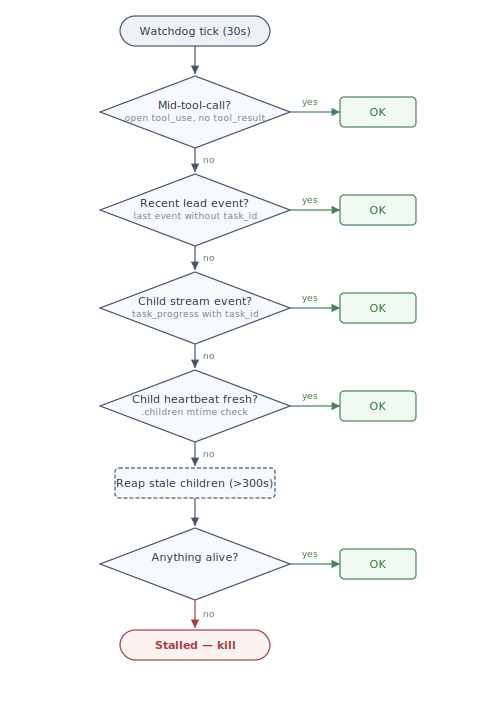

# Bidirectional Heartbeat Liveness

**Status:** Draft
**Issue:** [#149](https://github.com/dlewissandy/teaparty/issues/149)

## Context

The stall watchdog in `claude_runner.py` equates "progress" with "stdout from the lead process." When a lead dispatches background agents and waits for results, the watchdog sees silence and kills the entire process tree, destroying work in progress.

The existing fix (`has_running_agents` boolean extending the timeout to 2 hours) cannot detect stalled children, cannot handle the lead dying and orphaning children, and does not generalize to nested hierarchical dispatch.

TeaParty runs multiple sessions in parallel, each with nested dispatch trees. Any solution must be hierarchy-aware and scoped; agents from one session tree must be invisible to another. This design assumes a local filesystem. `os.utime()` mtime semantics are unreliable over NFS or SMB.

## Design

Each agent touches a heartbeat file every 30 seconds. Each agent also watches its parent's heartbeat. Every level of the hierarchy only cares about its own direct children.

### The heartbeat file

One file per agent instance in the dispatch's infra directory, replacing the `.running` sentinel.

```
.sessions/20260308-203749/
  .heartbeat                              # session lead
  coding/20260308-211516/
    .heartbeat                            # sub-team lead
```

Contents:

```json
{"pid": 12345, "parent_heartbeat": "/abs/path/to/parent/.heartbeat", "role": "coding", "started": 1711234567.0, "status": "starting"}
```

The file has two phases. At creation it contains the orchestrator's PID and `"status": "starting"`. Once the subprocess launches, the writer updates the `pid` field to the subprocess PID and sets `"status": "running"`. After that, updates happen only via `os.utime()` every 30 seconds. No locking, no contention during the steady-state beat cycle.

On clean exit, the writer sets `"status": "completed"` or `"status": "withdrawn"` depending on the CfA outcome. On crash, the status stays `"running"` with a stale mtime. This gives the recovery scan four distinguishable states without a separate file: never existed (no file), running (status `"running"`, fresh mtime), running but dead (status `"running"`, stale mtime or PID gone), and finished (status `"completed"` or `"withdrawn"`).

The `started` field stores `psutil.Process(os.getpid()).create_time()`, not `time.time()`. On macOS this has microsecond resolution; on Linux the actual accuracy is roughly one second despite the many decimal places `psutil` returns (see psutil issue #877). PID wraparound takes minutes to hours even under heavy load, so the sub-second tolerance is more than sufficient. A heartbeat is stale after 120 seconds (4 missed beats). Before declaring anything dead, the watchdog confirms the PID is gone via `psutil` and that `create_time()` differs from `started`.

### Child heartbeat discovery

At dispatch time, the parent records each child in a `.children` file in its own infra directory, using JSONL format (one JSON object per line). Each entry includes the heartbeat path, team name, and for liaison dispatches, the liaison's `task_id` from the lead's stream.

```jsonl
{"heartbeat": "/abs/path/.heartbeat", "team": "coding", "task_id": null, "status": "active"}
{"heartbeat": "/abs/path/.heartbeat", "team": "testing", "task_id": "task_abc123", "status": "active"}
```

The parent writes an entry before starting the dispatch (optimistic registration) and updates it with the actual heartbeat path once the child is running. A stale optimistic entry with no heartbeat file on disk is detectable and cleanable by the recovery scan.

This last field, `task_id`, matters because a liaison is a background agent in the lead's own process that blocks on an MCP call while its dispatch runs as a separate process. The liaison is not a child in the heartbeat hierarchy; it has no heartbeat file of its own. But the `.children` entry links the stream-visible liaison to the disk-visible dispatch. The watchdog monitors the liaison through the lead's own stream (checking for open tool calls and task_id events). The `.children` fallback lets the watchdog say: the liaison's stream activity stopped, but the dispatch it spawned is still alive on disk, so the system is making progress.

Appends to a JSONL file are atomic on local filesystems for writes under the pipe buffer size (4KB on most systems; these entries are under 200 bytes). Entry "removal" is a status field update, not line deletion. The watchdog reads `.children` on each cycle. Compaction (rewriting the file to remove completed entries) happens during the recovery scan, when no concurrent writes are in flight.

### Heartbeat writer lifecycle

The heartbeat writer is an async task inside `ClaudeRunner.run()`, alongside the existing stdout reader, stderr reader, and watchdog. It runs in the same task group as the subprocess reader; an unhandled exception cancels the group and propagates, making writer failure fatal to the dispatch.

The file is created before the subprocess launches, using the orchestrator's PID. During this window (milliseconds), a reader would see the orchestrator's PID, which is alive since the orchestrator is the one launching the subprocess. A liveness check against that PID returns the correct answer: the agent's infrastructure is alive and initializing. If the subprocess launch fails entirely, the writer writes a terminal status and exits.

Once the subprocess starts, the writer updates the PID field and begins the steady-state beat cycle. It stops when the subprocess exits. Touching a dead process's heartbeat would falsely signal liveness. The 90-second slack between a single missed beat (30s) and the stale threshold (120s) is generous for event loop scheduling jitter. A sustained 120-second event loop stall would indicate a frozen process, which is the condition we want to detect.

### What the watchdog becomes

The current watchdog uses raw stdout timing. The stream file is richer: it contains typed events, and events without a `task_id` come from the lead while events with one come from a background agent. The watchdog should use these semantics.



The watchdog runs a priority cascade every 30 seconds. First it checks whether the lead is mid-tool-call. The watchdog maintains a `dict[str, float]` mapping open `tool_use_id`s to their start timestamps. An open `tool_use` with no `tool_result` means the agent is working, even if it has been silent for minutes. A tool call open for longer than the stale threshold (120s) is treated as stale, not as proof of activity; this catches the case where a subprocess crashes mid-tool-call and the `tool_result` never arrives. The mid-tool-call check also covers spoke-and-wheel communication: `AskQuestion` and `AskTeam` MCP calls appear as tool calls in the stream, so an agent blocked on a proxy response or a dispatch has an open tool call the watchdog can see.

If no active (non-stale) tool call, the watchdog checks for recent lead events (within 120s), then recent child stream events (also within 120s). If the stream shows nothing, it falls back to the `.children` heartbeat check on disk. This catches the liaison case: a liaison's `task_id` has gone silent in the stream, but its linked dispatch heartbeat (recorded in `.children`) is still fresh.

Only when all four checks fail does the watchdog take action: it kills children whose heartbeats have been stale for more than 300 seconds (10 missed beats), then checks if anything remains alive. If not, the agent is truly stalled.

### How children detect a dead parent

The child checks its parent's heartbeat every 30 seconds. If stale and `psutil` confirms the PID is dead, the child sets a shutdown flag and waits for the Claude subprocess to exit (up to 60 seconds). The 60 seconds is a shutdown grace period, not a completion guarantee. An agent in the middle of a 10-minute compilation will not finish in time, and that is acceptable; the parent is dead and no one is going to consume this agent's output anyway. The goal is to save work that is nearly complete.

After the subprocess exits or the timeout expires, the child runs `git add -A && git commit` in its worktree. If the worktree is in a dirty merge state, the commit fails, and the child exits without committing; a partial merge should not be committed. Finally the child writes terminal status to the heartbeat file and exits. On macOS, `os.getppid()` changing to 1 (launchd) is a second signal. Children do not attempt tree-level recovery. They preserve their own state and get out of the way.

### Recovery

Infrastructure failures are the lead's problem. Task failures are the human's problem.

When the parent watchdog finds a dead child, it checks the child's CfA state, which `engine.py` persists to `.cfa-state.json` on every transition. `save_state()` should use atomic writes (write-to-temp + rename) to prevent corruption from mid-write crashes. The atomic write eliminates corrupt files but does not eliminate the gap between "work complete" and "state persisted." That gap is single-digit milliseconds in normal operation (the time between subprocess exit and the `save_state()` call), and a crash in that window leaves a stale but valid state file. The `--resume` mechanism handles it: the resumed agent sees the completed work in the worktree and advances to the terminal state.

If the CfA state is terminal-success (`COMPLETED_WORK`), merge the worktree and move on. If terminal-failure (`WITHDRAWN`, escalation), surface the failure to the lead; do not merge, because the worktree contains incomplete work. If non-terminal and retries remain, re-dispatch with `--resume`: reuse the worktree, load CfA state from the existing file, pass the prior Claude session ID for conversation continuity. `dispatch()` gains a `resume_worktree` parameter that skips worktree creation and loads CfA state from the existing `.cfa-state.json`. Stream files are append-only and a partial stream is usable (the session ID appears in the first few events).

Each re-dispatch increments `.retry-count` in the child's infra directory. Crashes, OOM kills, and stall timeouts are retryable with immediate retry, since these conditions are typically transient. API 529s are retryable with exponential backoff and jitter, matching the existing 529 handling in `claude_runner.py`. Budget is 3 attempts per phase, with a total cap of 9 attempts per child regardless of CfA advancement. This prevents a child that advances one state and then consistently crashes from consuming unbounded retries. If retries are exhausted, surface the failure to the lead as context and let it decide whether to skip, re-scope, or escalate. A child CfA escalation or withdrawal is not retryable. The child is saying the work cannot be done.

### Recovery at every level

Any agent at any level might be resuming into a world where a prior incarnation dispatched children that are now orphaned. On startup, every agent scans its `.children` registry. The scan runs before MCP listeners start, so no new dispatches arrive during recovery. Completed children (terminal-success heartbeat status) get merged. Dead non-terminal children get re-dispatched. Live children get left alone, though the new incarnation writes a fresh heartbeat so its adopted children see a live parent. If a `.children` entry references a worktree that no longer exists on disk, the entry is stale and gets removed during compaction.

This logic lives in `Orchestrator`, not `Session`, because any dispatching agent needs it.

### OS-level death notification

`kqueue` (macOS) and `pidfd_open` (Linux) provide instant process death notification without polling. But they don't detect stalls, and they don't survive the monitoring process crashing. A future optimization could layer them on top of heartbeats for faster death detection.

## Integration points

The `.running` sentinel appears in at least 12 production files and 5 test files.

`worktree.py` writes `.heartbeat` instead of `.running` and accepts a parent heartbeat path. `find_orphaned_worktrees` checks mtime staleness plus PID; the manifest schema gains an infra directory path so the orphan detector can locate the heartbeat file (which lives in the infra directory, not the worktree itself).

`ClaudeRunner` gets a heartbeat writer task in its task group and a watchdog that uses stream semantics and `.children` heartbeats instead of `has_running_agents`. The existing `_kill_process_tree` remains OS-level (`os.killpg`/`os.kill`); `psutil` is used only for PID liveness and `create_time()` checks.

`dispatch_cli.py` threads the parent heartbeat path through, gains a `resume_worktree` parameter for the recovery path, and writes a terminal status to the heartbeat on clean exit (not delete) so recovery can distinguish "finished" from "never existed."

`dispatch_listener.py` writes the liaison `task_id` and dispatch heartbeat path to the parent's `.children` registry (optimistic registration before dispatch, update after).

`Orchestrator` gains a startup recovery scan that merges or re-dispatches orphaned children before MCP listeners start.

The watchdog publishes events to the `EventBus` when it detects stale heartbeats, kills children, triggers recovery, or initiates retries. `state_reader.py` reads `.heartbeat` instead of `.running` for dashboard display.

## Testing strategy

The interesting failure modes are races, partial failures, and timing. The key test scenarios: stale heartbeat detection (inject fake heartbeat files with controlled mtimes), parent death detection (fake `psutil` responses), recovery scan with mixed child states (completed, dead non-terminal, live, missing worktree), `.children` compaction with concurrent readers, and the graceful exit sequence under subprocess timeout. The async components can be tested with controlled event loops and deterministic mocks. This follows the same `unittest.TestCase` with `_make_*()` helpers pattern used throughout the test suite.

## Parameters

| | Value | Rationale |
|-|-------|-----------|
| Beat interval | 30s | Balances detection latency (stale at 120s, ~2 min worst case) against filesystem metadata overhead for trees with dozens of concurrent agents |
| Stale threshold | 120s | 4 missed beats; 90s of slack tolerates GC pauses and IO transients |
| Alive-but-not-beating kill | 300s | 10 missed beats |
| Parent death grace | 60s | Shutdown budget for saving nearly-complete work, not a completion guarantee |
| Retry budget | 3 per phase, 9 per child | Per-phase resets on CfA state advancement; total cap prevents unbounded retries |
| 529 backoff | Exponential with jitter | Matches existing `claude_runner.py` 529 handling |

## New dependency

`psutil` — `pid_exists()`, `Process.create_time()`.
