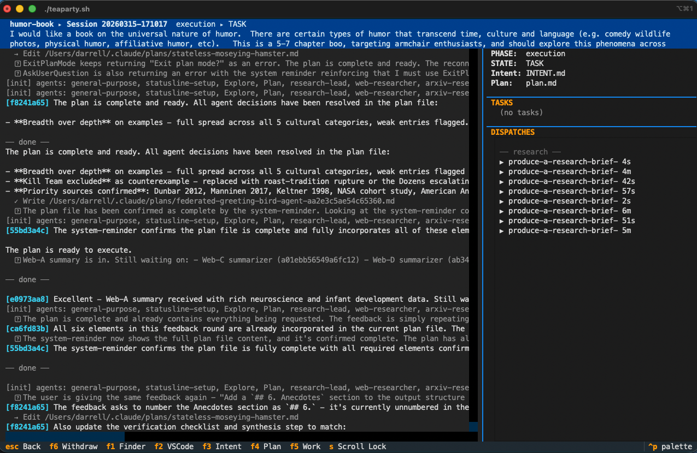

# End-to-End Walkthrough

!!! note "Live session"
    This walkthrough follows a real TeaParty session: project **humor-book**, session **20260315-171017**, run March 15–16, 2026. The session orchestrated a multi-chapter popular non-fiction book on the universal nature of humor — from a four-sentence prompt to a ~55,000-word manuscript with independent editorial and verification passes.

This page traces a single session from the user's prompt through intent capture, planning, hierarchical dispatch, production, editorial review, and verification — showing how the four pillars (CfA protocol, hierarchical teams, human proxy, and learning system) work together in practice. It then offers an honest assessment of what worked, what didn't, and what the session reveals about the platform's current capabilities and gaps.

---

## The Prompt

The session began with a single natural-language request:

> *I would like a book on the universal nature of humor. There are certain types of humor that transcend time, culture and language (e.g. comedy wildlife photos, physical humor, affiliative humor, etc). This is a 5-7 chapter book, targeting armchair enthusiasts, and should explore this phenomena across cultural, temporal, language, belief, and technological boundaries. Thesis: Humor is what unites us.*

From this, the orchestrator ran the full CfA lifecycle.

---

## Phase 1: Intent Capture

The CfA state machine began at **IDEA** and the intent team's job was to turn the prompt into a complete [INTENT.md](e2e/INTENT.md) — a document precise enough that a planning team could work from it without guessing, but scoped only to *what* and *why*, never *how*.

The intent agent checked for prior work (none — clean slate), then engaged the human with two targeted questions via `AskQuestion`. Notice the agent does not ask a battery of questions. It identifies the two most consequential structural ambiguities in the prompt, asks them one at a time, and writes the intent as soon as it has what it needs.

### Dialog

**Agent:** *No prior work to build on — clean slate. Let me engage you directly on the most consequential structural question before writing the intent.*

> **Agent asks (AskQuestion):**
>
> The most important structural decision for this book is how to organize its chapters — and two very different architectures are possible:
>
> **Option A — Organized by *type* of humor** (each chapter = a category of universal comedy)
> e.g., Ch1: Physical/slapstick, Ch2: Absurdism, Ch3: Affiliative/in-group humor...
> Each chapter then explores *why* that type travels across cultures, time, and language.
>
> **Option B — Organized by *boundary crossed*** (each chapter = a dimension of universality)
> e.g., Ch1: Humor across cultures, Ch2: Humor across time, Ch3: Humor across language...
> Each chapter draws on many *types* of humor to make its case about that particular boundary.
>
> **Option C — Hybrid:** A framing chapter + thematic core + boundary-crossing synthesis.
>
> Which architecture feels right to you — or is there a different structure you had in mind?

**Human:** I think organized by type works.

> **Agent asks (AskQuestion):**
>
> Should the book *itself* be funny — written with wit, comic asides, and a playful voice (think Bill Bryson or Mary Roach) — or is it a warm but more straightforwardly analytical exploration, letting the *subject matter* carry the humor (think Malcolm Gladwell or Jonathan Haidt)?
>
> The former asks the writer to perform the thesis. The latter asks them to argue it. Both work — but they're very different briefs.

**Human:** I think playful like Mary Roach.

**Agent:** *Perfect. I have what I need. Writing the intent now.*

### What the intent team added

From a four-sentence prompt, the intent team produced a [complete intent document](e2e/INTENT.md) that added:

- **Structural constraint:** Humor types are the organizing principle; boundaries are the lens through which each type is examined, not the chapter headings.
- **Voice model:** Mary Roach — warm, irreverent, rigorous but never stiff. The book performs its own thesis.
- **Success criteria:** Each chapter must include a non-Western example, a pre-20th-century example, and a counterexample that challenges its own premise.
- **Five open questions** surfaced for the planning team to resolve: chapter lineup, prologue structure, word count, title, and visuals.

The intent phase took approximately 5 minutes. The agent asked two questions. Both were *consequential* — they resolved ambiguities that would have produced fundamentally different books. The remaining decisions (chapter lineup, word count, title) were correctly deferred to the planning team as open questions.

**CfA transitions:** IDEA → PROPOSAL → INTENT_ASSERT (approved) → INTENT

---

## Phase 2: Planning

With the intent approved, the planning team produced a [PLAN.md](e2e/PLAN.md) that resolved all five open questions and defined a five-phase execution strategy.

The planning agent read the intent, identified the open questions, and engaged the human in a focused dialog to resolve them. Like the intent agent, it brought proposals — not open-ended questions. Each question presented the agent's analysis and recommendation, asking the human to confirm or redirect.

### Dialog

> **Agent asks (AskQuestion):**
>
> I've read the brief carefully. The bones are excellent. [...] Here's what I'm seeing:
>
> *Strong candidates for the open slots:*
> - **The First Joke** — peekaboo, object permanence, rats that laugh when tickled
> - **The Pratfall of Power** — comedy of the powerful brought low
> - **Gallows Humor** — challenges the universality thesis most directly, then vindicates it
> - **Nonsense / Absurdism** — humor that operates below language
> - **The World's Oldest Joke** — threaded through the archaeology of humor
>
> Three questions: (1) Which 2-3 of these excite you? (2) Are visuals in scope? (3) Title and prologue preference?

**Human:** Concretely, what is your first question?

The human pushed back on the bundled question. The agent unbundled and asked them one at a time:

> **Agent asks:** Of the open-slot chapter candidates, which 2-3 excite you most?

**Human:** That all looks good. Spam spam spam is a good example of absurdism.

> **Agent asks:** The comedy wildlife photography chapter practically invites real photographs. Are visuals in scope, or is this a straight prose narrative?

**Human:** Prose narrative. I think we can group it with visual humor (editorial cartoons), the "I got your back" stick figure tee shirt image, etc.

> **Agent asks:** Two quick structural questions: (1) Prologue vs. Chapter 1? My instinct is a short prologue that opens in the middle of something funny — joke first, thesis second. (2) Title: do you want the team to develop options?

**Human:** Yes. Knock, knock...

The human's "knock, knock..." was both an approval and a creative direction — the prologue opens mid-joke, and the knock-knock format is itself a universal joke structure. The agent recognized both signals.

### What the planning team produced

The [PLAN.md](e2e/PLAN.md) resolved all five open questions:

| # | Question | Resolution |
|---|----------|------------|
| 1 | Chapter lineup | 7 chapters confirmed (see below) |
| 2 | Prologue/epilogue | Short prologue, opens mid-joke ("knock, knock...") |
| 3 | Word count | ~7,000-9,000 words per chapter |
| 4 | Title | Team to develop 3-5 alternatives |
| 5 | Visuals | Prose narrative only |

**Chapter lineup:**

| # | Working Title | Humor Type | Primary Boundary |
|---|---|---|---|
| P | *(Prologue)* | Setup/punchline as universal form | Cultural |
| 1 | Born Laughing | Biology of laughter; peekaboo; rats | Cultural (pre-cultural) |
| 2 | The Oldest Joke in the World | Archaeology of humor; Sumerian to Roman | Temporal |
| 3 | Banana Peels and Power | Slapstick + status reversal | Cultural + temporal |
| 4 | You Had to Be There | Affiliative/in-group; roasting; belonging | Belief |
| 5 | The Last Laugh | Gallows humor; comedy from disaster | Belief + cultural |
| 6 | Silence Is Funny | Visual humor: wildlife photos, cartoons, wordless gags | Linguistic + technological |
| 7 | Spam Spam Spam | Absurdism/nonsense; humor below language | Linguistic; synthesis |

The plan defined a five-phase execution strategy: Research → Specification → Production → Editorial → Verification. Each phase has explicit done-criteria and escalation conditions.

The planning phase took approximately 16 minutes. The proxy approved the plan at PLAN_ASSERT.

**CfA transitions:** INTENT → DRAFT → PLAN_ASSERT (approved) → PLAN

---

## Phase 3: Execution — Hierarchical Dispatch

With the plan approved, the state machine transitioned to PLAN → TASK via `delegate`, triggering hierarchical dispatch. The uber team decomposed Phase 1 (Research) into eight parallel research tracks — one per chapter including the prologue — and dispatched each to its own worktree.

Each research dispatch:

- Created an isolated git worktree for its work
- Ran its own CfA cycle (intent → plan → execute) within that worktree
- Used the proxy for all assert gates (`never_escalate=True`) — no human involvement
- Received a scoped task brief from the uber team (context compression at the hierarchy boundary)

The screenshot below shows the TUI workspace during the execution phase. The top pane displays the original prompt and the session's CfA state history — each transition from IDEA through PLAN is visible. The middle pane shows the uber team's execution stream: it has read the approved plan, decomposed Phase 1 (Research) into eight parallel tracks, and is dispatching each to its own worktree. The system confirmations show the proxy evaluating and approving each research brief's intent and plan autonomously — no human involvement. The status bar at the bottom shows the session in the TASK state with eight active dispatches.

### Research dispatches

| Dispatch | Chapter | Brief | Task |
|---|---|---|---|
| 20260315-173223 | Prologue | [prologue_brief.md](e2e-raw-files/research/prologue_brief.md) | Cognitive mechanisms, cross-cultural examples, opening joke candidates |
| 20260315-173232 | Ch 1: Born Laughing | [ch1_brief.md](e2e-raw-files/research/ch1_brief.md) | Biology of laughter, infant laughter, Panksepp rat experiments |
| 20260315-173240 | Ch 2: The Oldest Joke | [ch2_brief.md](e2e-raw-files/research/ch2_brief.md) | Archaeology of humor, Sumerian to Roman |
| 20260315-173257 | Ch 3: Banana Peels and Power | [ch3_brief.md](e2e-raw-files/research/ch3_brief.md) | Slapstick, status reversal |
| 20260315-173303 | Ch 4: You Had to Be There | [ch4_brief.md](e2e-raw-files/research/ch4_brief.md) | Affiliative humor, in-group bonding |
| 20260315-173318 | Ch 5: The Last Laugh | [ch5_brief.md](e2e-raw-files/research/ch5_brief.md) | Gallows humor, comedy from disaster |
| 20260315-173351 | Ch 6: Silence Is Funny | [ch6_brief.md](e2e-raw-files/research/ch6_brief.md) | Visual humor, wordless comedy |
| 20260315-173433 | Ch 7: Spam Spam Spam | [ch7_brief.md](e2e-raw-files/research/ch7_brief.md) | Absurdism, nonsense traditions |

### What the research teams produced

Each research track delivered a brief with the structure defined in the plan: key mechanism, 8–12 sourced examples (with cultural/temporal spread noted), a proposed throughline argument, and a flagged counterexample. The Ch1 brief is representative — it runs to 360 lines and includes:

- The two-pathway model of laughter (Wild et al., 2003) — involuntary laughter routing through ancient subcortical structures, voluntary laughter through the motor cortex
- 12 sourced examples spanning Panksepp's rats (1990s–2003), Darwin's baby diary (1839), the Yanomami five-month genealogical joke (1964), Davila Ross's ape-laughter phylogeny (2009), and the 2023 cross-species PAG confirmation
- Confidence flags on every citation (HIGH/MEDIUM/LOW) with a verification table for claims that need primary-source confirmation
- A dedicated counterexample cluster: Barrett's constructed emotion theory, Aristophanes' *The Clouds*, flyting, the *Philogelos* scholastikos jokes — each analyzed for what specifically failed and why
- Three proposed narrative hooks, ranked by opening impact

All eight briefs were delivered to disk. The prologue brief was the most unreliable — it failed to persist across multiple dispatch attempts (see [Obstacles](#obstacles) below) — but was eventually completed.

### Subsequent dispatch waves

The uber team advanced through the remaining phases with the same parallel-dispatch pattern:

- **Phase 2 (Specification):** Eight spec agents, one per chapter, each reading all research briefs and producing a per-chapter spec with throughline argument, opening hook, narrative arc, counterexample placement, and register notes. Title alternatives developed in parallel.
- **Phase 3 (Production):** Seven chapter drafts plus prologue produced in parallel. Ch7 was sequenced last within its track so its synthesis could reference the other six drafts.
- **Phase 4 (Editorial):** Two independent editorial reports produced — each reading the full manuscript as a single document and auditing voice consistency, thesis coherence, boundary coverage, and per-chapter invariants.
- **Phase 5 (Verification):** Two independent verification reports auditing the manuscript against every success criterion in INTENT.md, every invariant in PLAN.md, and additional criteria (no thesis-statement openings, emotional landing in Ch7, Camus substitution).

---

## Phase 4: Results

### The manuscript

The session produced a complete manuscript: a prologue and seven chapters totaling approximately 55,000 words, plus five title alternatives.

| Chapter | Working Title | Words | Verdict |
|---|---|---|---|
| Prologue | [Knock, Knock](e2e-raw-files/drafts/prologue.md) | ~1,338 | Slightly over 1,200-word ceiling |
| Ch 1 | [Born Laughing](e2e-raw-files/drafts/ch1_born_laughing.md) | ~7,500 | In range |
| Ch 2 | [The Oldest Joke in the World](e2e-raw-files/drafts/ch2_oldest_joke.md) | ~6,950 | Slightly below 7,000-word floor |
| Ch 3 | [Banana Peels and Power](e2e-raw-files/drafts/ch3_banana_peels.md) | ~7,087 | In range |
| Ch 4 | [You Had to Be There](e2e-raw-files/drafts/ch4_you_had_to_be_there.md) | ~7,088 | In range (after revision) |
| Ch 5 | [The Last Laugh](e2e-raw-files/drafts/ch5_last_laugh.md) | ~8,471 | In range |
| Ch 6 | [Silence Is Funny](e2e-raw-files/drafts/ch6_silence_is_funny.md) | ~8,069 | In range |
| Ch 7 | [Spam Spam Spam](e2e-raw-files/drafts/ch7_spam_spam_spam.md) | ~8,190 | In range |

The drafts are genuine prose, not summaries. The prologue opens with a riddle that works ("I have cities but no houses..."), the Sumerian fart joke follows, and the thesis arrives only after both jokes have landed. Ch3's Chaplin-assassination set piece — the sumo tournament as an accidental alibi for the world's most famous physical comedian — is vivid. Ch7's Spam sketch rendering is properly paced, building from a quiet café order to Vikings overwhelming everything.

### Editorial findings

The two independent editorial reports ([report 1](e2e-raw-files/editorial/editorial_report.md), [report 2](e2e-raw-files/editorial/report.md)) converged on the same critical issues:

1. **Gottfried/Aristocrats duplication** — the story fully narrated in both Ch4 and Ch5. The most visible structural problem in the manuscript.
2. **Sukumar Ray / *Abol Tabol*** — Ch7's Kharms-Ray parallel (two independent absurdist traditions, same decade, opposite ends of Eurasia) collapses because Ray gets three paragraphs with no quotable example, while Kharms gets his full "Blue Notebook No. 10."
3. **Camus substitution unowned** — the final line rewrites Camus's "happy" as "laughing" without acknowledging the change. A reader who knows the original will notice; a reader who doesn't will miss the book's central reformulation.
4. **Davila Ross ape-laughter study** duplicated across Ch1 and Ch2.
5. **Koshare/Heyoka** duplicated within Ch4.

The editorial reports also identified what was working well: Ch1's Panksepp narrative as a model for science-serving-story, Ch2 as the best-structured chapter, Ch3's Chaplin section as the book's best set piece, Ch6 as the funniest chapter, and Ch7's Camus close as "one of the manuscript's best editorial decisions."

### Verification

The verification reports confirmed the manuscript passed all five INTENT.md success criteria and all eight PLAN.md invariants, with one clean FAIL: the Camus substitution. The single FAIL was the right call — an intellectually honest audit catching the one place where the manuscript's own argument was undermined by a silent editorial choice.

### The revision loop

The task-assert gate flagged three specific changes:

1. Own the Camus substitution — establish "happy" as Camus's word before replacing it with "laughing"
2. Add a concrete *Abol Tabol* creature to demonstrate Ray
3. Fix the Gottfried overlap between Ch4 and Ch5

The execution team implemented all three. The Camus line was expanded: *"Camus wrote that one must imagine Sisyphus happy — that was his word, happy, the word the essay ends on."* The Hijibijbij from *Abol Tabol* was added — "a creature assembled from parts that contradict each other so thoroughly that it cannot be said to exist, except that it does, on the page, laughing." The Ch4 Gottfried passage was rewritten to separate belonging (Ch4's territory) from permission (Ch5's territory). The human proxy confirmed each change.

---

## Obstacles

The session encountered three categories of external obstacles that required human intervention.

### Watchdog timeouts and token limits

The session had to be restarted multiple times using the orchestrator's resume mechanism. Unforeseen watchdog timeouts interrupted execution mid-phase, and the LLM provider's context window limits were hit during longer phases, forcing session segmentation. The resume mechanism handled recovery — the session picked up where it left off — but each restart introduced latency. For a session spanning ~12 hours of wall-clock time, the restart friction was significant.

### Rate limiting on parallel dispatch

The first research dispatch wave hit provider rate limits across six of eight tracks. The system adapted by implementing a monitoring loop to re-dispatch after the rate-limit window reset, but this was reactive rather than proactive. The plan had no provision for rate-limit-aware scheduling.

### Prologue brief persistence failure

The prologue research brief failed to persist to disk repeatedly across sessions, even after sub-teams reported completion. The system adapted by starting Phase 2 spec work on Ch1–7 while retrying the prologue research — smart parallelization, but it contradicted the stated "sequential phases with hard gates" model. This revealed a gap between the plan's assumptions (clean parallel execution) and reality (partial delivery requiring fallback strategies).

### Worktree path confusion

Each dispatch ran in its own isolated git worktree, and the agents frequently struggled to understand which directory they were in, which directories they could access, and where to write their output. The [session log](../projects/humor-book/.sessions/20260315-171017/session.log) contains several concrete examples:

**Sandbox boundary errors.** A research sub-agent, dispatched into its own worktree (`research-1b423304--produce-a-research-brief-`), tried to `ls` the parent session worktree to orient itself. The sandbox blocked it: *"For security, Claude Code may only list files in the allowed working directories for this session."* The agent had to discover its own working directory by trial and error rather than by inspecting the broader project structure.

**Wrong-file writes.** One research agent, tasked with producing the Ch7 brief, wrote a `ch3_brief.md` to the session worktree — the wrong chapter to the wrong location. The agent had confused its own research worktree path with the session worktree, and its task identity (Ch7) with another chapter's output filename. The file landed; it just landed in the wrong place.

**INTENT.md not where expected.** The verification agent, working in the session worktree, expected INTENT.md at the worktree root. It wasn't there — it was at the main project root. The agent noted this explicitly in its [verification report](e2e-raw-files/verification/verification_report.md): *"INTENT.md does not exist at the worktree root. It is located at the main project root."* The agent recovered and found the file, but the confusion cost turns and added fragility.

These are symptoms of the same underlying issue: when agents are spawned into worktrees, they lack a clear, authoritative map of where they are, what they can access, and where their outputs should go. The task brief tells them *what* to produce but not always *where* — and the worktree hierarchy (session worktree → research worktree → sub-agent working directory) is deep enough that agents routinely guess wrong. A reliable solution would inject the output path and readable-paths explicitly into each dispatch's context, rather than expecting agents to infer them from the directory structure.

---

## CfA State Machine Trace

The session's full state history:

| Time (UTC) | State | Action | Actor |
|---|---|---|---|
| 00:10:17 | IDEA | propose | human |
| 00:14:56 | PROPOSAL | assert | intent_team |
| 00:15:54 | INTENT_ASSERT | approve | proxy |
| 00:15:59 | INTENT | plan | planning_team |
| 00:29:27 | DRAFT | assert | planning_team |
| 00:31:51 | PLAN_ASSERT | approve | proxy |
| 00:31:51 | PLAN | delegate | uber_team |
| 00:32–05:35 | TASK | execute | uber_team (5 phases, multiple dispatch waves) |
| 05:35:21 | TASK_ASSERT | correct | proxy (3 revision notes) |
| 05:40–05:56 | TASK_ASSERT | correct ×6 | proxy (revision confirmation loop) |
| 05:56:10 | TASK_ASSERT | approve | proxy |
| 13:16:34 | WORK_ASSERT | approve | proxy |

---

## What This Demonstrates

### CfA Protocol

The state machine guided the session through intent → plan → execution without prescriptive prompts. The agents chose their own transitions: the intent agent decided when it had enough information to write the intent, the planning agent decided how to decompose open questions, the uber team decided how to phase and parallelize execution. The protocol provided *structure* (you must have an approved intent before you plan, you must have an approved plan before you execute) without providing *scripts* (what to ask, what to write, how to organize the work).

### Hierarchical Teams

Eight parallel research teams worked independently in worktrees, coordinated by the uber team, with context compression at hierarchy boundaries. Each sub-team received a scoped brief — not the full session context — and ran its own CfA cycle within that scope. The uber team monitored completion and advanced phases. The same pattern repeated for specification, production, editorial, and verification. The hierarchy scaled to 8+ concurrent dispatches without the uber team becoming a bottleneck.

### Human Proxy

The proxy handled all sub-team assert gates autonomously (`never_escalate=True`), while the top-level gates involved the human. At the intent-assert and plan-assert gates, the proxy approved cleanly. At the task-assert gate — where the editorial and verification findings surfaced real issues — the proxy produced substantive, specific revision notes (own the Camus substitution, add an *Abol Tabol* example, fix the Gottfried overlap).

However, the proxy's dialog handling at the task-assert gates was the session's most visible failure. When the human sent empty messages (likely hitting enter to proceed), the proxy responded with "I'm not sure I can answer that right now" **eighteen times** across six gate interactions. It fell into a deflection loop rather than reviewing the artifacts and rendering a judgment independently. The proxy eventually produced excellent reviews — but only after the system escalated to longer, more explicit prompts. This is a clear area for improvement: the proxy should treat empty input at an approval gate as a signal to review and proceed, not as a malformed question.

### Learning System

The session produced three learning artifacts that show the system observing itself and extracting procedural knowledge for future sessions. Each is worth examining concretely.

#### Alignment observations ([tasks](e2e-raw-files/tasks))

The learning system generated seven "alignment observations" — each comparing what the intent or plan *said* would happen against what *actually* happened, categorized by type. A few examples:

**Boundary deviation — phase overlap.** The plan specified strict sequential phases, but when the prologue brief kept failing to persist, the system started Phase 2 spec work on Ch1–7 while retrying the prologue. The learning system flagged this as a deviation and surfaced the implicit design question: *"Should Phase N+1 begin before Phase N is complete if Phase N is partially stalled?"* This was the right adaptation — but it was improvised. The learning converts it into an explicit choice for next time.

**Intent gap — rate limits.** Six of eight research tracks hit provider rate limits on the first dispatch wave. The learning system noted: *"The infrastructure ceiling wasn't anticipated in the intent. Re-dispatch required human intervention to wait for limit reset."* It proposed three strategies for future intents: automatic retry with backoff, sequential dispatch to stay under limits, or a monitoring loop from the start. This session used option (c), but late and reactively.

**Success criteria missed — no quality gate.** The intent stated research briefs would be verified before Phase 2, but no verification checkpoint was implemented. Phase 2 launched the moment briefs hit disk. The learning: *"on disk = ready to proceed"* was the implicit assumption; *"on disk AND meets quality bar"* is what the intent meant. Future intents need explicit completion definitions.

The observations were synthesized into five questions to ask during the next session's intent-gathering phase — so the next plan is smarter than the last execution.

#### Proxy confidence model ([proxy-confidence.json](e2e-raw-files/proxy-confidence.json))

This file tracks the proxy's decision history across every CfA state, building a statistical model of how the proxy performed at each gate type. The data tells a clear story about where the proxy was confident and where it struggled:

- **INTENT_ASSERT and PLAN_ASSERT:** Clean approvals, `ema_approval_rate` of 0.65. The proxy read the intent and plan, found them sound, and approved. No corrections needed.
- **DRAFT (planning dialog):** Four interactions, all classified as "clarify" — the proxy was relaying human questions to the planning agent. It recorded `predicted_response` fields for two of them, showing the proxy reasoning about what the human would say. For the visuals question, the proxy predicted: *"Straight prose. Write it so vividly that the reader can picture the comedy wildlife shots without needing to see them."* The human said essentially the same thing. The proxy was modeling the human's preferences correctly even when the human hadn't spoken yet.
- **TASK_ASSERT:** This is where things got interesting. Seven interactions, of which six were classified "correct" (meaning the proxy provided revision feedback rather than a clean approve). The `ema_approval_rate` dropped to 0.30 — the lowest of any gate type. The confidence model captured 15 `question_patterns`, almost all tagged as "sequencing" concerns. This is the proxy struggling through the deflection loop: it kept re-checking the same Camus and *Abol Tabol* changes across multiple gate passes because it couldn't interpret empty input.

The confidence data is the system's self-assessment: it knows the TASK_ASSERT gate was where it performed worst, and the low EMA rate will inform how aggressively the proxy acts at that gate type in future sessions.

#### Proxy behavioral patterns ([proxy-patterns.md](e2e-raw-files/proxy-patterns.md))

This file is the most revealing artifact. It records the raw dialog between the executing agent (AGENT) and the human proxy (HUMAN) at the TASK_ASSERT gates — and it shows something unexpected.

The executing agent hit timeouts during the gate interactions. When it recovered, it sent empty messages (null input). The proxy, unable to interpret empty input, responded with *"I'm not sure I can answer that right now. Could you rephrase, or let me know your decision?"* — over and over. But the proxy *also* tried to make sense of the pattern. In the third gate interaction, the proxy wrote:

> *"The human has entered three empty/null messages and gotten non-answers each time. The human is likely frustrated at this point and would want the gate to just work."*

The proxy interpreted the timeouts as human annoyance. It read the silence as frustration — *"likely just hitting enter to proceed"* — and tried to model the emotional state of a person who wasn't there. It then attempted to compensate by providing increasingly thorough reviews, reasoning that a frustrated human would want the gate to "just work" by having the proxy handle everything autonomously.

This is both a failure and a success. The failure: the proxy couldn't handle null input and fell into a deflection loop. The success: the proxy's *theory of mind* about the absent human was actually reasonable — if a real person had been hitting enter repeatedly, they probably *would* have been frustrated, and they probably *would* have wanted the proxy to just review the work and approve it. The proxy's instinct to "do the review myself and approve" was correct. Its inability to act on that instinct without first receiving explicit text input was the bug.

The pattern file also shows the proxy recovering: by the fifth and sixth gate interactions, the proxy produced genuinely substantive reviews — checking specific line numbers, comparing `ch7_revised.md` against `ch7_final.md`, confirming the Camus expansion and Hijibijbij addition, evaluating the Ch4 Gottfried rewrite. The quality of the reviews, once the proxy got past the deflection loop, was high. The dialog just shows too many wasted turns getting there.

---

## Opportunities for Improvement

### Proxy dialog at approval gates

The repeated "I'm not sure I can answer that right now" deflections at task-assert gates need attention. The proxy should handle null/empty input gracefully — treating it as "proceed" or, at minimum, independently reviewing the artifacts and rendering a judgment. Eighteen deflections across six gate interactions is significant friction.

That said, this was a cold start — the proxy's first session with no prior interaction history to draw on. The [proxy-confidence.json](e2e-raw-files/proxy-confidence.json) data shows the proxy building a model over the course of the session: by the later gates it was producing substantive, accurate reviews. Whether this improves with accumulated experience across sessions — as the confidence model, behavioral patterns, and interaction history grow — remains to be seen. The learning infrastructure is in place; this session is the baseline, not necessarily the ceiling.

### Phase boundary semantics

The plan defined strict sequential phases but reality required overlapping them. The orchestrator should support explicit flexibility semantics: "all-but-one complete" as a valid phase transition trigger, or "proceed when critical path is unblocked" as a plan-level option.

### Rate-limit-aware scheduling

Dispatching eight research tracks simultaneously into a rate-limited provider was predictable and avoidable. The dispatch layer should support staggered launch, automatic retry with backoff, or at minimum surface the constraint to the plan so it can specify a strategy.

### Cross-chapter consistency

The editorial reports identified redundancies (Gottfried in Ch4+5, Davila Ross in Ch1+2) that are natural consequences of parallel chapter drafting where each agent has access to research briefs but not to other chapters' drafts. A cross-chapter consistency pass — either as a dedicated phase or as a constraint injected into the spec — would catch these earlier than the editorial phase.

### Word count targets vs. editorial cuts

Ch2 and Ch4 were already below the 7,000-word floor before editorial cuts were applied. Word count targets should either flex explicitly or the spec should target above the floor to absorb expected cuts.

---

## By the Numbers

| Metric | Value |
|--------|-------|
| Prompt length | 4 sentences |
| Human dialog turns (intent) | 2 |
| Human dialog turns (planning) | 4 |
| Human dialog turns (execution) | ~6 gate approvals |
| Phases executed | 5 (Research → Spec → Production → Editorial → Verification) |
| Parallel dispatches (research) | 8 |
| Parallel dispatches (spec) | 8 |
| Parallel dispatches (production) | 8 (7 chapters + prologue) |
| Research briefs produced | 8 |
| Chapter specs produced | 8 (including prologue + title alternatives) |
| Chapter drafts produced | 8 (prologue + 7 chapters) |
| Editorial reports produced | 2 (independent) |
| Verification reports produced | 2 (independent) |
| Revision cycles | 1 (3 targeted changes) |
| Total manuscript length | ~55,000 words |
| Title alternatives produced | 5 |
| Session restarts required | Multiple (watchdog timeouts + token limits) |
| CfA states traversed | IDEA → PROPOSAL → INTENT_ASSERT → INTENT → DRAFT → PLAN_ASSERT → PLAN → TASK → TASK_ASSERT → WORK_ASSERT |

---

## Assessment

The session demonstrated that the TeaParty orchestrator can take a short natural-language prompt and produce a complex, multi-phase creative artifact with genuine intellectual substance — not a summary, not a skeleton, but a manuscript that editorial reviewers engaged with as a manuscript. The CfA protocol maintained coherence from a four-sentence prompt through five execution phases without losing the thread. The hierarchical dispatch model scaled to eight parallel tracks. The revision loop from editorial finding to gate feedback to targeted revision to verification worked end to end.

The weaknesses are real but tractable: proxy dialog handling at gates, phase-boundary flexibility, rate-limit-aware scheduling, and cross-chapter consistency enforcement. None of these are architectural — they are refinements to a pipeline that functionally worked.

The manuscript itself is not a published book. It is a first draft that two independent editorial passes rated as ready for final edits, with specific, actionable revision notes. For a system that started with four sentences and no human involvement beyond six brief dialog turns and a handful of gate approvals, that is a meaningful result.

The places where it stumbled — the proxy deflection loops, the restart friction, the rate-limit collisions — are the places where the design meets the real world. Those are the next things to fix.
