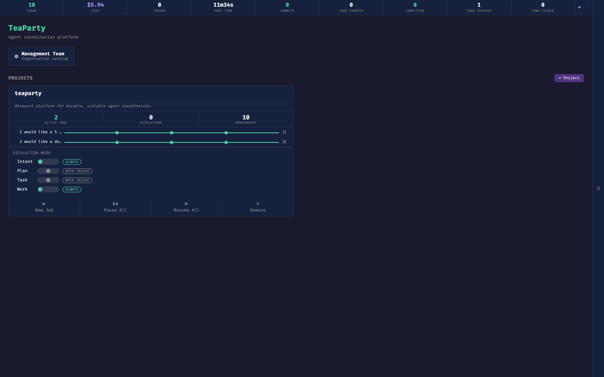

# Quickstart

Get TeaParty running locally, open the dashboard, and drive a first session through the three CfA phases. Plan for about ten minutes end-to-end.

Before you start, skim [overview](../overview.md) for the mental model: a management team, project teams, and workgroups running under the [CfA state machine](../systems/cfa-orchestration/index.md). This page won't re-explain those concepts — it just gets you to a running session.

## Prerequisites

- Python 3.12+
- [`uv`](https://docs.astral.sh/uv/) package manager
- `git`
- [Claude Code CLI](https://docs.anthropic.com/en/docs/claude-code) authenticated to a **Claude Max** account. TeaParty uses the Max OAuth token exclusively; API keys are not supported.

## Install

From the repo root:

```bash
uv sync
```

That resolves the environment declared in `pyproject.toml`. No other install step is required.

## Open the dashboard

```bash
./teaparty.sh
```

The script bootstraps `uv` if missing, then launches the bridge server:
`uv run python3 -m teaparty.bridge --teaparty-home "$REPO_ROOT/.teaparty"`.

Open <http://localhost:8081>. You will land on the management view: the stats bar, the Management Team card, the project list with active jobs, and escalation-mode settings. The page updates live as sessions emit state.



The stats bar at the top tracks session health — turns, cost, process time, commits, job counts, conversation counts. On the right edge, a collapsible chat blade opens into the Office Manager conversation (shown throughout [Steering a Session](steering-sessions.md)).

Optionally, in another terminal:

```bash
uv run mkdocs serve
```

The documentation site renders at <http://localhost:8000>.

## Run your first session

Two entry points produce the same result — a CfA session that walks Intent, then Planning, then Execution.

**From the dashboard.** Click a project, then start a session from its Sessions card. The session opens a project-level chat with the project lead and the proxy.

**From the CLI.**

```bash
uv run python -m teaparty "Draft a one-page summary of our research pillars"
```

What to expect at each phase:

- **Intent.** The intent lead drafts an `INTENT.md` and the proxy asks whether you recognize this as your idea, completely and accurately articulated. Correct it in chat until you approve.
- **Planning.** The project lead produces a strategic `PLAN.md`. The proxy asks whether the plan operationalizes your idea well. Refine or approve.
- **Execution.** The project lead dispatches tasks to workgroup agents, each in its own worktree. The proxy compares deliverables to the intent and plan at the final gate.

At any point you can INTERVENE (course correction at the next turn boundary) or WITHDRAW (cascading kill). Both are described in [overview](../overview.md#humans-in-the-loop).

## Where things get written

Each job gets an isolated git worktree:

```
.teaparty/jobs/job-{id}--{slug}/worktree/
```

Parallel tasks branch off that worktree. Session state, artifacts (`INTENT.md`, `PLAN.md`, deliverables), and `.cfa-state.json` all live under the job directory. For the full on-disk layout — config tree, catalogs, conversations, learnings — see [folder-structure](../reference/folder-structure.md).

## Next steps

- [Steering a Session](steering-sessions.md) — intervention, withdrawal, memory-based steering.
- [Configuring Teams](configuring-teams.md) — projects, workgroups, agents, D-A-I roles.
