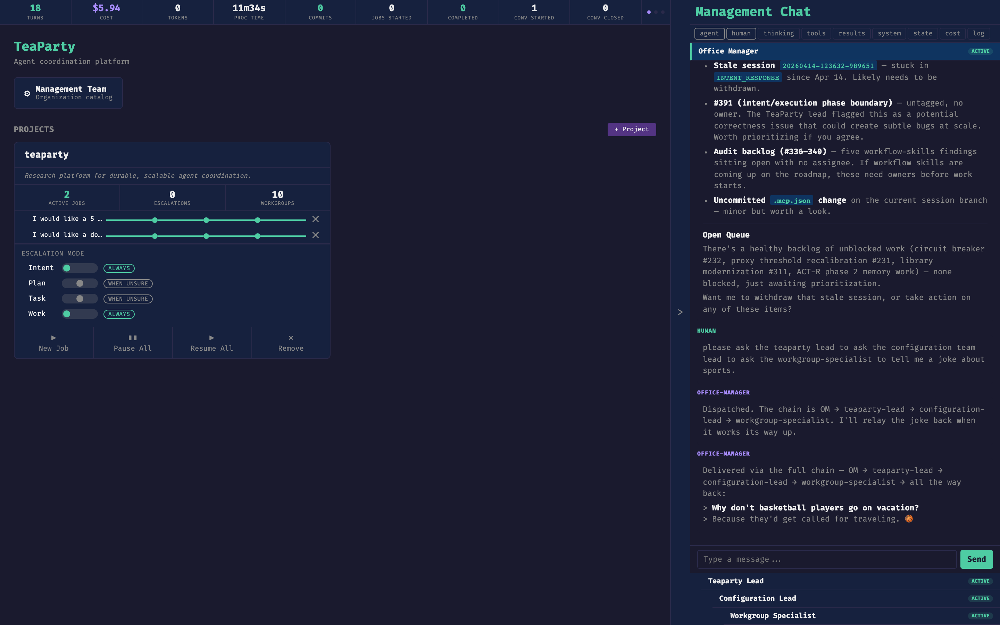
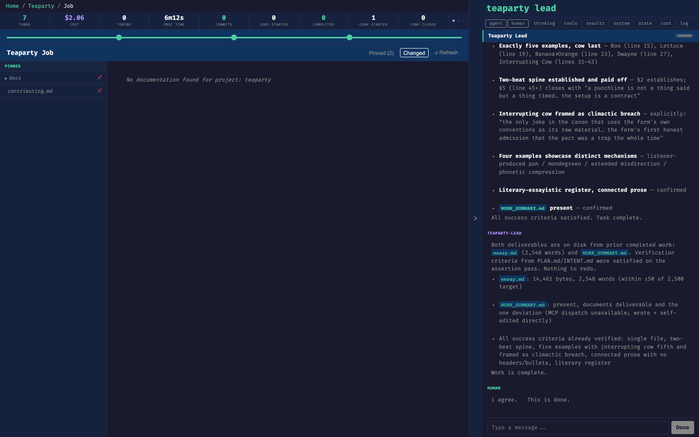

# Steering a Session

A running TeaParty session is not a black box you wait on. This guide covers the practical controls you have while work is in flight — who you can talk to, how to course-correct, and how to shape the proxy so it represents you well at gates. For the conceptual model behind any of this, see [overview](../overview.md) and [systems/](../systems/index.md).

## Who you can talk to

The dashboard's chat blade mounts on every page that isn't a full-screen chat, and who it connects to depends on where you are. See [chat-ux](../systems/bridge/chat-ux.md) for the routing table.

- **Office Manager.** The chat blade on the home page is bound to the OM. This is your coordination surface: status across all projects, cross-project steering, and the place to ask "what's going on right now" or "take this new piece of work and put it somewhere sensible." Use it when your question spans projects or when you're not yet sure which project owns the answer.
- **Project lead.** Project pages connect to the project's lead. Use it when a question is scoped to one project — a specific job's direction, whether a task is going the right way, or steering within the plan.
- **Your proxy.** The dashboard exposes a proxy-review conversation you can open directly. This is the only surface where you talk *to* the thing that stands in for you at gates. Use it for calibration, not for coordination — see [Calibrating the proxy](#calibrating-the-proxy) below.

Multiple conversations persist simultaneously. Leaving the OM to talk to a project lead doesn't end the OM thread; both survive on the bus.

The chat blade header names the current conversation (here, *Management Chat* talking to the Office Manager), the filter tabs control which event types render in the transcript, and the list below the input shows every agent currently active on the bus. Clicking one switches the blade to that conversation.

## Intervening vs. withdrawing

Two orthogonal controls sit on top of the [CfA state machine](../systems/cfa-orchestration/index.md).

**INTERVENE** is a course correction. Typing into an active session's chat emits an INTERVENE event, which the agent receives at its next turn boundary — not mid-step. It is advisory by default and authoritative when it comes from the decider for that level ([D-A-I roles](../overview.md#d-a-i-role-model)). Use it when the work is salvageable but pointed slightly wrong: "focus on the login path, not the signup path," "skip the migration for now," "the constraint I forgot to mention is X." The agent sees your message at its next decision point and factors it in.

**WITHDRAW** is a kill signal. The Withdraw button (and the `WithdrawSession` MCP tool) sets the session's CfA state to WITHDRAWN, cascades through the dispatch hierarchy immediately, terminates running processes, and finalizes the heartbeat. Use it when the work itself should stop: the approach is wrong, the premise has changed, the output is no longer needed. Intervention cannot fix those — they are terminal.

Rule of thumb: if a well-phrased correction would fix it, intervene. If no correction would, withdraw.

## Pausing and resuming

`PauseDispatch` halts a dispatch without terminating it: work already in flight completes, but no new phases launch. `ResumeDispatch` brings it back.

Common reasons to pause:

- You need to make a human decision that gates this work but belongs elsewhere (e.g. waiting on a review in another system).
- You want to talk to the OM or a project lead without the dispatch racing ahead.
- A dependency outside TeaParty (an API, a deploy, another team) has to settle first.

Pausing is cheaper than withdrawing and then re-dispatching. Use it whenever the work is correct but the timing isn't.

## Reprioritizing

`ReprioritizeDispatch` changes a running or paused dispatch's priority (for example `high`, `normal`, `low`). The priority influences how the OM and project leads interleave work across concurrent dispatches. Reprioritize when something urgent arrives and an in-flight dispatch needs to yield, or when a dispatch you marked urgent can now cool down. Terminal dispatches cannot be reprioritized.

## Calibrating the proxy

The [Human Proxy](../systems/human-proxy/index.md) is a learned model of how you make decisions, consulted at every gate. Its quality is a direct function of the signal you give it.

Open a proxy-review conversation from the dashboard and talk to it the way you would talk to a colleague learning your preferences. Disagree with a past call it made. Explain the reasoning behind a decision. Point at a pattern it missed. Corrections flow back into the same memory the proxy consults at gate time — there is not a separate "chat proxy" and "gate proxy." Calibration is always-on: every exchange is training data.

The useful mental model is that escalations are the proxy asking for help, and proxy-review conversations are you volunteering it unprompted. Both feed the same store.

## At approval gates

When the proxy doesn't have enough confidence to approve on your behalf, it escalates. You'll see the decision land in the chat blade as an input request — the gate is waiting on you. Respond in the chat.

Your response is the ground truth the proxy learns from. Approve, reject, or redirect — and when the call is non-obvious, say *why*. The proxy records a differential between what it would have decided and what you actually decided; the reason you give is what turns that differential into a transferable pattern rather than a one-off data point.

Gates are also where INTERVENE is cheapest. If you're going to approve but want the next phase shaped differently, say so in the same response — the agent reads your gate answer before transitioning.

On a job page, the chat blade is scoped to that job's project lead. Here the lead has just summarized the job against its success criteria; the human response at the bottom (*"i agree. This is done."*) is the gate approval. The **Done** button commits the approval and advances the state machine.
